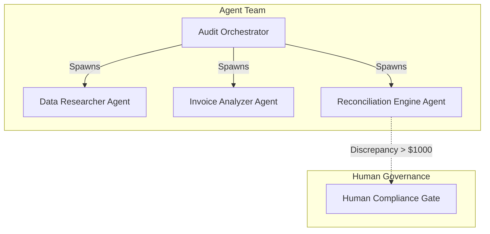
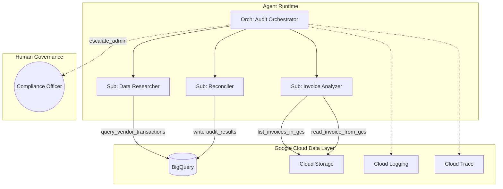
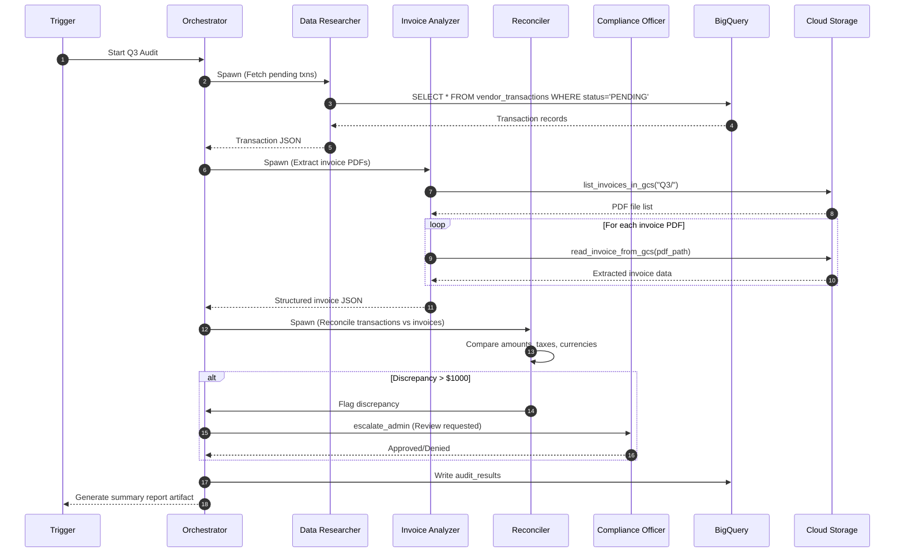
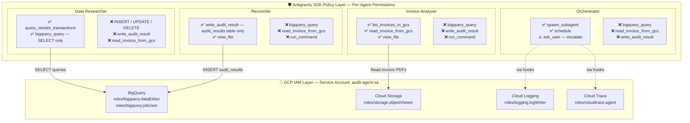

# Hands-On Tutorial: Building an Autonomous Financial Audit Agent Team with Antigravity + Google Cloud
*A complete step-by-step guide to building, testing, and deploying a multi-agent financial reconciliation workflow using the Google Antigravity SDK and Google Cloud Platform.*

---

### Section 1: Overview

**1.1 What You'll Build**

In this tutorial, you will build an autonomous, multi-agent financial audit system capable of reconciling vendor transactions against PDF invoices. Instead of relying on a single large language model prompt, you will architect a team of specialized agents, each with scoped responsibilities, strict security boundaries, and distinct capabilities. 

This agent team consists of:
- **Audit Orchestrator** — The manager. It holds the high-level objective, delegates tasks to subagents, and manages the 4-phase workflow state machine (trigger, gather, reconcile, report).
- **Data Researcher Agent** — A read-only specialist tasked with querying BigQuery for pending vendor transactions.
- **Invoice Analyzer Agent** — A read-only specialist that locates and extracts structured line-item data from PDF invoices stored in Google Cloud Storage (GCS).
- **Reconciliation Engine Agent** — The analytical core. It receives data from the Researcher and Analyzer, matches transactions to invoices, verifies tax calculations, and flags mismatches.
- **Human Compliance Gate** — Not an AI, but a declarative policy hook that pauses execution and escalates any discrepancy above $1,000 to a human compliance officer for manual review before writing results.

Why not just give one agent access to everything? Because a single agent with BigQuery write access, GCS access, and command execution creates an unacceptable blast radius. By organizing the workflow as a multi-agent team, we implement the principle of least privilege, isolate the complex reasoning, and create a verifiable chain of custody for every decision.



**1.2 Prerequisites**
To follow along, you will need:
- A Google Cloud project with billing enabled
- `gcloud` CLI installed and authenticated
- Python 3.11+ with `pip`
- The Antigravity SDK installed (`pip install google-antigravity`)
- Basic familiarity with BigQuery SQL and Python
- A Google Cloud project with Vertex AI API enabled
- `google-cloud-bigquery` Python client library

**1.3 Tutorial Approach**
This tutorial uses a fully cloud-native approach with real GCP services: BigQuery, Cloud Storage, Cloud Logging, and Cloud Trace. You will provision real infrastructure and validate results against live data.

---

### Section 2: GCP Services

The enterprise architecture relies on several Google Cloud services to provide data, storage, and observability.

| GCP Service | Role |
|:---|:---|
| **BigQuery** | Transaction data warehouse + audit results |
| **Cloud Storage** (GCS) | Invoice PDF storage |
| **Cloud Logging** | Structured agent audit trail |
| **Cloud Trace** | Distributed tracing across agent calls |
| **IAM** | Least-privilege service accounts |
| **Cloud Run** | Agent deployment target (stretch goal) |

---

### Section 3: Architecture

Understanding the architecture is crucial before writing code. We separate concerns between the Agent Runtime, the Data Layer, and Human Governance.

**Diagram 1 — System Architecture**


**Diagram 2 — Workflow State Machine**


**Diagram 3 — Security Boundary Map: SDK Policies × GCP Services**

This diagram maps two layers of security. The **SDK Policy Layer** controls what each agent can do at the tool level. The **GCP IAM Layer** controls what the service account can access at the infrastructure level. Both must allow an action for it to succeed.



**Security permission matrix — which agent can touch which GCP service:**

| Agent | BigQuery READ | BigQuery WRITE | GCS LIST + READ | Cloud Logging | Cloud Trace |
|:---|:---:|:---:|:---:|:---:|:---:|
| **Orchestrator** | ❌ | ❌ | ❌ | ✅ (via hooks) | ✅ (via hooks) |
| **Data Researcher** | ✅ SELECT only | ❌ | ❌ | ✅ (via hooks) | ✅ (via hooks) |
| **Invoice Analyzer** | ❌ | ❌ | ✅ list + read | ✅ (via hooks) | ✅ (via hooks) |
| **Reconciler** | ❌ | ✅ audit_results only | ❌ | ✅ (via hooks) | ✅ (via hooks) |

> **🔑 Key Insight:** Notice the **defense in depth**. Even if the Data Researcher's LLM were prompt-injected to attempt a `DELETE FROM vendor_transactions`, it would be blocked at *two* levels: the SDK policy engine rejects non-SELECT queries, and the BigQuery IAM role only grants `dataEditor` on the `financial_audit` dataset (not `bigquery.admin`). The Invoice Analyzer can list and read PDFs from GCS but has zero BigQuery access. The Orchestrator itself has no direct data access — it can only delegate to scoped subagents.

The data flow is strictly controlled. The Orchestrator manages state and escalation but does not touch raw data. The Researcher and Analyzer are read-only. The Reconciler can only write to specific output locations.

This illustrates the **principle of least privilege** applied to AI. Each agent's policy represents the MINIMUM set of permissions required for its specific job. The Researcher doesn't need to read PDFs, so it doesn't get GCS access. The Analyzer doesn't need database access, so BigQuery is denied. This compartmentalization ensures that even if an agent hallucinates or is subjected to prompt injection via a malicious invoice PDF, it cannot compromise the broader system.

---

### Section 4: Step-by-Step GCP Provisioning

**Step 4.1: Create Project & Enable APIs**

Start by creating a dedicated GCP project and enabling the six cloud services your agent team will use. Each API corresponds to a specific role: BigQuery for data, Cloud Storage for PDFs, Cloud Logging and Cloud Trace for observability, and Cloud Run for future deployment.

```bash
export PROJECT_ID="financial-audit-tutorial"
gcloud projects create $PROJECT_ID --name="Financial Audit Tutorial"
gcloud config set project $PROJECT_ID
gcloud services enable bigquery.googleapis.com storage.googleapis.com logging.googleapis.com cloudtrace.googleapis.com secretmanager.googleapis.com run.googleapis.com
```

> **💡 Tip:** Ensure your GCP project has billing linked using `gcloud billing projects link $PROJECT_ID --billing-account=YOUR_ACCOUNT_ID`. Also, all `gcloud` commands in this section assume you have already authenticated using `gcloud auth login`.

**Step 4.2: Create BigQuery Dataset & Tables**

We only create two tables: `vendor_transactions` (the ERP source of truth) and `audit_results` (where the agent writes findings). Invoice data is **not** pre-loaded into BigQuery — the agent extracts it from PDF files stored in GCS.

```bash
bq mk --dataset $PROJECT_ID:financial_audit

# Create vendor_transactions — the ERP source of truth
bq mk --table $PROJECT_ID:financial_audit.vendor_transactions \
vendor_id:STRING,vendor_name:STRING,invoice_num:STRING,amount:FLOAT64,currency:STRING,tax_rate:FLOAT64,status:STRING,quarter:STRING,transaction_date:DATE

# Create audit_results — the agent writes its findings here
bq mk --table $PROJECT_ID:financial_audit.audit_results \
execution_id:STRING,vendor_id:STRING,invoice_num:STRING,transaction_amount:FLOAT64,invoice_amount:FLOAT64,discrepancy_amount:FLOAT64,status:STRING,agent_notes:STRING,reviewed_by:STRING,timestamp:TIMESTAMP
```

> **📝 Note:** We intentionally plant discrepancies between the transaction records (BigQuery) and the invoice PDFs (GCS) to test the agent's analytical capabilities:
> - **Vendor 8492**: The ERP transaction records $142,300 at 8.5% tax, but the vendor's PDF invoice shows $138,750 at 6.25% tax.
> - **Vendor 3301**: The ERP transaction is recorded in USD, but the vendor's PDF invoice is denominated in EUR.
> - **Vendor 5567**: The ERP has two transactions with the same invoice number but different amounts ($23,400 and $24,100), while only one PDF invoice exists.
> 
> The agent must discover these discrepancies by reading both data sources — it is never told where the errors are.

Populate the transactions table with ERP data. These represent what your company's accounting system has recorded — amounts, tax rates, currencies, and invoice numbers. Think of this as the "source of truth" from the internal financial system:
```sql
-- Run this in the BigQuery Console or via bq query
INSERT INTO `YOUR_PROJECT_ID.financial_audit.vendor_transactions` 
(vendor_id, vendor_name, invoice_num, amount, currency, tax_rate, status, quarter, transaction_date) VALUES
('8492', 'TechCorp Solutions', 'INV-8492-Q3-001', 142300.00, 'USD', 0.085, 'PENDING', 'Q3', '2026-07-15'),
('1022', 'OfficeSupplies Co', 'INV-1022-Q3-014', 4500.00, 'USD', 0.05, 'PENDING', 'Q3', '2026-07-20'),
('3301', 'Global Services Ltd', 'INV-3301-Q3-099', 87500.00, 'USD', 0.10, 'PENDING', 'Q3', '2026-08-01'),
('5567', 'Consulting Group Inc', 'INV-5567-Q3-001', 23400.00, 'USD', 0.0, 'PENDING', 'Q3', '2026-08-10'),
('5567', 'Consulting Group Inc', 'INV-5567-Q3-001', 24100.00, 'USD', 0.0, 'PENDING', 'Q3', '2026-08-12');
```

Notice we are **not** inserting any invoice data into BigQuery. The corresponding invoice PDFs (generated in Step 5.6) will be uploaded to GCS. The agent must read and parse those PDFs to get the vendor's side of the story, then compare against these transaction records. The discrepancies between these two data sources are what the agent needs to discover autonomously.

**Step 4.3: Prepare Invoice PDFs**
In a real scenario, these live in a Google Cloud Storage bucket. We will use a script to generate sample PDFs (see Step 5.6) and upload them to `gs://YOUR_PROJECT_ID-audit-invoices/Q3/`.

**Step 4.3b: Create GCS Bucket and Upload Invoices**

Create a regional Cloud Storage bucket to hold the vendor-submitted invoice PDFs. The `-l us-central1` flag co-locates the bucket with your BigQuery dataset for low-latency access. After generating sample PDFs (Step 5.6), upload them into a `Q3/` prefix to organize invoices by quarter:

```bash
# Create a regional bucket for invoice PDFs
gsutil mb -l us-central1 gs://$PROJECT_ID-audit-invoices

# Generate and upload sample invoices (after running generate_sample_invoices.py)
gsutil -m cp data/invoices/*.pdf gs://$PROJECT_ID-audit-invoices/Q3/

# Verify uploads — you should see 4 PDF files
gsutil ls gs://$PROJECT_ID-audit-invoices/Q3/
```


**Step 4.4: Create Service Account with Least-Privilege IAM**

Create a dedicated service account for the audit agent and grant it only the minimum IAM roles required. Each role maps to a specific capability: `dataViewer` for reading BigQuery tables, `jobUser` for running queries, `logWriter` for writing structured audit logs, `cloudtrace.agent` for publishing trace spans, and `storage.objectViewer` for reading invoice PDFs from GCS. The agent cannot delete data, modify tables, or access other projects.

```bash
# Create the service account
gcloud iam service-accounts create audit-agent-sa \
    --display-name="Audit Agent Service Account"

SA_EMAIL="audit-agent-sa@$PROJECT_ID.iam.gserviceaccount.com"

# BigQuery: read transactions + write audit results
gcloud projects add-iam-policy-binding $PROJECT_ID \
    --member="serviceAccount:$SA_EMAIL" \
    --role="roles/bigquery.dataViewer" --condition=None
gcloud projects add-iam-policy-binding $PROJECT_ID \
    --member="serviceAccount:$SA_EMAIL" \
    --role="roles/bigquery.jobUser" --condition=None

# Cloud Logging: write structured audit events
gcloud projects add-iam-policy-binding $PROJECT_ID \
    --member="serviceAccount:$SA_EMAIL" \
    --role="roles/logging.logWriter" --condition=None

# Cloud Trace: publish distributed trace spans
gcloud projects add-iam-policy-binding $PROJECT_ID \
    --member="serviceAccount:$SA_EMAIL" \
    --role="roles/cloudtrace.agent" --condition=None

# Cloud Storage: read-only access to invoice PDFs
gcloud projects add-iam-policy-binding $PROJECT_ID \
    --member="serviceAccount:$SA_EMAIL" \
    --role="roles/storage.objectViewer" --condition=None
```

> **💡 Tip:** The `--condition=None` flag is required when your project already has conditional IAM policies. Without it, the command will fail with a `"Adding a binding without specifying a condition is prohibited"` error.


**Step 4.5: Verify Setup**

Before writing any code, verify that all infrastructure was provisioned correctly. These two commands confirm the BigQuery dataset exists and the service account has the expected IAM roles:

```bash
# Verify BigQuery dataset and tables exist
bq ls $PROJECT_ID:financial_audit

# Verify IAM roles assigned to the service account
gcloud projects get-iam-policy $PROJECT_ID \
  --flatten="bindings[].members" \
  --format='table(bindings.role)' \
  --filter="bindings.members:audit-agent-sa"
```

You should see `roles/bigquery.dataViewer`, `roles/bigquery.jobUser`, `roles/logging.logWriter`, `roles/cloudtrace.agent`, and `roles/storage.objectViewer` in the output.

---

### Section 5: Antigravity SDK Code — Step by Step

**Step 5.1: Project Scaffolding**

Create the project directory, set up a Python virtual environment, and install the core dependencies. `google-antigravity` is the SDK itself; `google-cloud-bigquery` and `google-cloud-storage` provide the GCP client libraries your tools will wrap; `reportlab` generates sample invoice PDFs; and `PyPDF2` enables PDF text extraction at runtime:

```bash
mkdir financial-audit-agent && cd financial-audit-agent
python -m venv .venv && source .venv/bin/activate
pip install google-antigravity google-cloud-bigquery google-cloud-storage reportlab PyPDF2
```

Create the directory structure. Each directory corresponds to a separation of concerns — `agents/` holds agent configurations, `tools/` holds GCP client wrappers, `policies/` holds security rule sets, `hooks/` holds observability integrations, and `eval/` holds test datasets:
```
financial-audit-agent/
├── main.py
├── run_audit.py
├── agents/
│   ├── __init__.py
│   ├── orchestrator.py
│   ├── data_researcher.py
│   ├── invoice_analyzer.py
│   └── reconciler.py
├── tools/
│   ├── __init__.py
│   └── bigquery_tools.py
├── policies/
│   ├── __init__.py
│   └── audit_policies.py
├── hooks/
│   ├── __init__.py
│   └── observability.py

├── eval/
│   └── eval_dataset.jsonl
└── README.md
```

**Step 5.2: Define Custom Tools**

Agents need tools to interact with external systems. In this tutorial, we define custom Python functions that wrap the Google Cloud client libraries (`google-cloud-bigquery` and `google-cloud-storage`) and pass them to the agent via the `tools` parameter in `LocalAgentConfig`.

| Tool | Purpose | Assigned To |
|:---|:---|:---|
| `query_vendor_transactions()` | Query BigQuery for pending transactions | Data Researcher, Orchestrator |
| `list_invoices_in_gcs()` | List all invoice PDFs in the GCS bucket | Invoice Analyzer |
| `read_invoice_from_gcs()` | Read and extract structured data from an invoice PDF | Invoice Analyzer |
| `write_audit_result()` | Write reconciliation results to BigQuery | Reconciler, Orchestrator |

Each tool is a standard Python function with type hints and a descriptive docstring. The SDK automatically registers them as callable tools the agent can invoke — the agent sees a list of available functions with descriptions and calls them as needed.

**Step 5.2b: Implement the Tools** (`tools/bigquery_tools.py`)

Create the following file with all four tool functions. Each function wraps a Google Cloud client library call and returns a JSON string that the agent can parse and reason over.

```python
from google.cloud import bigquery, storage
import json

PROJECT_ID = "YOUR_PROJECT_ID"  # Replace with your GCP project ID
DATASET = "financial_audit"

_client = bigquery.Client(project=PROJECT_ID)


def query_vendor_transactions(quarter: str = "Q3") -> str:
    """Query BigQuery for all PENDING vendor transactions in a given quarter.

    Args:
        quarter: The fiscal quarter to query (e.g. "Q3").

    Returns:
        JSON string with the transaction records.
    """
    query = f"""
    SELECT vendor_id, vendor_name, invoice_num, amount, currency, tax_rate, status, quarter, transaction_date
    FROM `{PROJECT_ID}.{DATASET}.vendor_transactions`
    WHERE status = 'PENDING' AND quarter = '{quarter}'
    ORDER BY vendor_id, invoice_num
    """
    rows = _client.query(query).result()
    results = []
    for row in rows:
        results.append({
            "vendor_id": row.vendor_id,
            "vendor_name": row.vendor_name,
            "invoice_num": row.invoice_num,
            "amount": row.amount,
            "currency": row.currency,
            "tax_rate": row.tax_rate,
            "status": row.status,
            "quarter": row.quarter,
            "transaction_date": str(row.transaction_date),
        })
    return json.dumps({"total_transactions": len(results), "transactions": results}, indent=2)


def list_invoices_in_gcs(bucket_name: str, prefix: str = "Q3/") -> str:
    """List all invoice PDF files in a Google Cloud Storage bucket.

    Args:
        bucket_name: The GCS bucket name (e.g. "my-project-audit-invoices").
        prefix: Path prefix to filter by (e.g. "Q3/" for Q3 invoices).

    Returns:
        JSON string with the list of invoice file paths.
    """
    storage_client = storage.Client(project=PROJECT_ID)
    bucket = storage_client.bucket(bucket_name)
    blobs = bucket.list_blobs(prefix=prefix)
    invoices = []
    for blob in blobs:
        if blob.name.endswith(".pdf"):
            invoices.append({
                "name": blob.name,
                "size_bytes": blob.size,
                "gs_uri": f"gs://{bucket_name}/{blob.name}",
            })
    return json.dumps({"total_invoices": len(invoices), "invoices": invoices}, indent=2)


def read_invoice_from_gcs(bucket_name: str, invoice_path: str) -> str:
    """Read an invoice PDF from Google Cloud Storage and extract its structured data.

    Downloads the PDF, parses its text content, and returns structured fields
    including vendor ID, invoice number, amounts, tax rate, and currency.

    Args:
        bucket_name: The GCS bucket name (e.g. "my-project-audit-invoices").
        invoice_path: Path to the invoice within the bucket (e.g. "Q3/INV-8492-Q3-001.pdf").

    Returns:
        JSON string with extracted invoice data (vendor_id, invoice_num,
        base_amount, tax_rate, tax_amount, total_amount, currency).
    """
    import re
    import tempfile
    storage_client = storage.Client(project=PROJECT_ID)
    bucket = storage_client.bucket(bucket_name)
    blob = bucket.blob(invoice_path)

    if not blob.exists():
        return json.dumps({"error": f"Invoice not found: gs://{bucket_name}/{invoice_path}"})

    # Download PDF to temp file and extract text
    with tempfile.NamedTemporaryFile(suffix=".pdf") as tmp:
        blob.download_to_filename(tmp.name)

        # Extract text using PyPDF2
        from PyPDF2 import PdfReader
        reader = PdfReader(tmp.name)
        text = ""
        for page in reader.pages:
            text += page.extract_text() or ""

    # Parse structured fields from the extracted text
    result = {
        "gs_uri": f"gs://{bucket_name}/{invoice_path}",
        "raw_text": text,
        "vendor_id": _extract(r"ID:\s*(\d+)", text),
        "vendor_name": _extract(r"Vendor:\s*(.+?)\s*\(", text),
        "invoice_num": _extract(r"INVOICE:\s*(INV-[\w-]+)", text),
        "base_amount": _extract_float(r"Base Amount:\s*([\d,.]+)", text),
        "tax_rate": _extract_float(r"Tax Rate:\s*([\d.]+)%", text),
        "tax_amount": _extract_float(r"Tax Amount:\s*([\d,.]+)", text),
        "total_amount": _extract_float(r"TOTAL:\s*([\d,.]+)", text),
        "currency": _extract(r"TOTAL:\s*[\d,.]+\s+(\w{3})", text),
    }
    # Convert tax_rate from percentage to decimal if found
    if result["tax_rate"] is not None:
        result["tax_rate"] = round(result["tax_rate"] / 100, 4)

    return json.dumps(result, indent=2)


def _extract(pattern: str, text: str) -> str | None:
    """Extract a single regex match from text."""
    import re
    m = re.search(pattern, text)
    return m.group(1).strip() if m else None


def _extract_float(pattern: str, text: str) -> float | None:
    """Extract a float value from text via regex."""
    import re
    m = re.search(pattern, text)
    if m:
        return float(m.group(1).replace(",", ""))
    return None


def write_audit_result(
    execution_id: str,
    vendor_id: str,
    invoice_num: str,
    transaction_amount: float,
    invoice_amount: float,
    discrepancy_amount: float,
    status: str,
    agent_notes: str,
    reviewed_by: str = "agent",
) -> str:
    """Write a single audit result row to BigQuery.

    Args:
        execution_id: Unique ID for this audit run.
        vendor_id: The vendor's ID.
        invoice_num: The invoice number.
        transaction_amount: Amount from the transaction record.
        invoice_amount: Amount from the invoice.
        discrepancy_amount: The difference (transaction - invoice).
        status: One of MATCHED, DISCREPANCY, UNMATCHED, ESCALATED.
        agent_notes: Agent's explanation of the finding.
        reviewed_by: Who reviewed this result.

    Returns:
        Confirmation message.
    """
    from datetime import datetime, UTC

    row = {
        "execution_id": execution_id,
        "vendor_id": vendor_id,
        "invoice_num": invoice_num,
        "transaction_amount": transaction_amount,
        "invoice_amount": invoice_amount,
        "discrepancy_amount": discrepancy_amount,
        "status": status,
        "agent_notes": agent_notes,
        "reviewed_by": reviewed_by,
        "timestamp": datetime.now(UTC).isoformat(),
    }

    table_ref = f"{PROJECT_ID}.{DATASET}.audit_results"
    errors = _client.insert_rows_json(table_ref, [row])

    if errors:
        return f"ERROR writing audit result: {errors}"
    return f"✅ Audit result written for vendor {vendor_id} / {invoice_num} — status: {status}"


# Export all tools as a list for the SDK
AUDIT_TOOLS = [query_vendor_transactions, list_invoices_in_gcs, read_invoice_from_gcs, write_audit_result]
```

These four functions give the agent typed, documented tools with clear input/output contracts. The `read_invoice_from_gcs` tool downloads the PDF, extracts text using PyPDF2, and parses structured fields (amounts, tax rates, currency) via regex. The agent never sees raw PDF bytes — it receives clean JSON.

> **💡 Tip:** Install PyPDF2 for PDF text extraction: `pip install PyPDF2`. Each tool function's docstring becomes the tool's description visible to the LLM. Write clear, specific docstrings — they directly affect the agent's ability to choose the right tool.

**Step 5.3: Define Safety Policies** (`policies/audit_policies.py`)

Safety policies are the SDK's mechanism for controlling what agents can and cannot do. Each policy tier represents a different level of trust: development (unrestricted for debugging), staging (human-in-the-loop for sensitive operations), and production (deny-by-default with surgical allowlists). The `compliance_officer_approval_handler` simulates a human gate — in production, you'd replace the `input()` call with a Slack notification or approval workflow:

```python
from google.antigravity.hooks import policy

async def compliance_officer_approval_handler(tool_call) -> bool:
    """Escalation handler for high-risk actions.
    
    Receives a types.ToolCall object. Use tool_call.name for the tool name
    and tool_call.args for the arguments dict.
    """
    print(f"\n🚨 ESCALATION REQUIRED 🚨")
    print(f"Action requested: {tool_call.name}")
    print(f"Arguments: {tool_call.args}")
    
    # In a real environment, this would ping Slack/Email and wait.
    # For this tutorial, we simulate a prompt.
    response = input("Compliance Officer, approve this action? (y/n): ")
    return response.lower() == 'y'

DEVELOPMENT_POLICIES = [
    policy.allow_all(),
]

STAGING_POLICIES = [
    policy.deny_all(),
    policy.allow("view_file"),
    policy.allow("list_dir"),
    policy.allow("grep_search"),
    policy.allow("bigquery_query"),
    policy.ask_user("run_command", handler=compliance_officer_approval_handler),
]

PRODUCTION_POLICIES = [
    policy.deny_all(),
    policy.allow("view_file"),
    policy.allow("list_dir"),
    policy.allow("grep_search"),
    policy.allow("bigquery_query",
                 when=lambda args: args.get("Query", "").strip().upper().startswith("SELECT"),
                 name="allow_bq_select_only"),
    policy.deny("run_command",
                when=lambda args: any(cmd in args.get("CommandLine", "") for cmd in ["rm", "DROP", "DELETE", "kubectl"]),
                name="deny_destructive_commands"),
    policy.ask_user("write_to_file",
                    when=lambda args: "audit_results" in args.get("TargetFile", ""),
                    handler=compliance_officer_approval_handler),
]
```

Notice the three distinct policy tiers:
- **DEVELOPMENT_POLICIES**: Uses `allow_all()`, meaning the agent can do anything. Use this *only* on your local machine for rapid iteration and debugging.
- **STAGING_POLICIES**: Introduces a human-in-the-loop for sensitive operations. The compliance handler will pause the agent and prompt you via `stdin` before executing `run_command` or other risky tools.
- **PRODUCTION_POLICIES**: Implements a strict deny-by-default posture with surgical allowlists. For instance, BigQuery queries must start with `SELECT` to prevent data modification, and destructive commands like `rm` or `DROP` are blocked at the kernel level.

> **⚠️ Important:** Never deploy with `allow_all()` in production. The deny-by-default posture ensures that even if the LLM is compromised via prompt injection (e.g., a malicious instruction hidden inside a vendor's PDF invoice), it cannot execute unauthorized actions.

**Step 5.4: Define the Agent Team**

Each agent in the team gets its own configuration file defining its system instructions (the "job description"), permitted tools, and security policies. The Antigravity SDK uses `LocalAgentConfig` for subagents and `CapabilitiesConfig` to control whether an agent can spawn other agents.

`agents/orchestrator.py` — The lead auditor. It holds the high-level workflow, has access to all tools, and can spawn subagents. Notice `vertex=True` to route through Vertex AI and `enable_subagents=True` to allow delegation:
```python
from google.antigravity import LocalAgentConfig, CapabilitiesConfig
from tools.bigquery_tools import AUDIT_TOOLS

def get_orchestrator_config(policies, workspace, project_id=None):
    return LocalAgentConfig(
        system_instructions="""
        You are the Lead Financial Auditor orchestrating a Q3 vendor reconciliation.
        
        Your workflow:
        1. Call query_vendor_transactions("Q3") to get all pending transactions from BigQuery
        2. Call list_invoices_in_gcs() to discover all invoice PDFs in the GCS bucket
        3. Call read_invoice_from_gcs() for each invoice to extract structured data from the PDF
        4. Compare extracted invoice data against transaction records — match by vendor_id and invoice_num
        5. If any discrepancy exceeds $1,000, flag it for human escalation
        6. Call write_audit_result() for each finding
        7. Generate a summary compliance report
        
        CRITICAL RULES:
        - Never modify the vendor_transactions table directly
        - Always escalate discrepancies over $1,000 — do not auto-approve
        - Log every decision with a clear rationale
        """,
        model="gemini-2.5-flash",
        capabilities=CapabilitiesConfig(enable_subagents=True),
        tools=AUDIT_TOOLS,
        policies=policies,
        workspaces=[workspace],
        vertex=True if project_id else None,
        project=project_id,
        location="us-central1" if project_id else None,
    )

**What's happening here:**
- `model="gemini-2.5-flash"` — Explicitly sets the model. Always verify available models with your Vertex AI project.
- `tools=AUDIT_TOOLS` — Passes the custom BigQuery functions as callable tools.
- `vertex=True` — Routes API calls through Vertex AI using Application Default Credentials (ADC).
- `project` and `location` — Specify the GCP project and region for Vertex AI.
- `CapabilitiesConfig(enable_subagents=True)` — Authorizes this agent to dynamically spawn child agents.
```

`agents/data_researcher.py` — The BigQuery specialist. It has a single allowed operation: run SELECT queries. The policy uses a `when` lambda to inspect the query string at runtime, ensuring only SELECT statements pass. Any INSERT, UPDATE, or DELETE attempt is denied before it reaches BigQuery:
```python
from google.antigravity import LocalAgentConfig
from google.antigravity.hooks import policy

def get_data_researcher_config(workspace):
    return LocalAgentConfig(
        system_instructions="""
        You are a Data Research Specialist. Your job is to query BigQuery
        for vendor transaction records. You have READ-ONLY access.
        
        Return results as a structured JSON summary with:
        - Total transactions found
        - List of vendor_id, invoice_num, amount, currency, tax_rate
        - Any data quality issues noted
        """,
        policies=[
            policy.deny_all(),
            policy.allow("bigquery_query",
                         when=lambda args: args.get("Query", "").strip().upper().startswith("SELECT"),
                         name="allow_bq_select_only"),
        ],
        workspaces=[workspace],
    )
```

`agents/invoice_analyzer.py` — The PDF extraction specialist. It can list and read files but has **zero** BigQuery access. Its system instructions tell it to enumerate GCS PDFs and extract structured data from each one. Even if this agent were compromised via a malicious PDF, it cannot touch the database:
```python
from google.antigravity import LocalAgentConfig
from google.antigravity.hooks import policy

def get_invoice_analyzer_config(workspace):
    return LocalAgentConfig(
        system_instructions="""
        You are an Invoice Analysis Specialist. Your job is to:
        1. List all invoice PDFs in the GCS bucket using list_invoices_in_gcs()
        2. Read each PDF using read_invoice_from_gcs() to extract structured data
        
        For each invoice, extract and return:
        - Vendor name and ID
        - Invoice number
        - Base amount, tax rate, tax amount
        - Total invoice amount
        - Currency
        
        Return results as structured JSON.
        """,
        policies=[
            policy.deny_all(),
            policy.allow("view_file"),
            policy.allow("list_dir"),
        ],
        workspaces=[workspace],
    )
```

`agents/reconciler.py` — The analytical core. It receives pre-fetched data from the other agents and performs the comparison logic. Its policies restrict it to `view_file` only — it cannot query databases or access GCS directly. The Orchestrator passes it the data it needs:
```python
from google.antigravity import LocalAgentConfig
from google.antigravity.hooks import policy

def get_reconciler_config(workspace):
    return LocalAgentConfig(
        system_instructions="""
        You are a Reconciliation Engine. You receive two datasets:
        1. Transaction records from BigQuery
        2. Invoice data extracted from PDFs
        
        For each transaction-invoice pair:
        - Match by vendor_id and invoice_num
        - Compare transaction amount vs invoice amount (tolerance: $0.01)
        - Verify tax rate calculations
        - Check currency consistency
        
        Classify each pair as:
        - MATCHED: amounts match within tolerance
        - DISCREPANCY: amounts differ — include the difference and likely cause
        - UNMATCHED: transaction exists but no corresponding invoice found
        
        Flag any discrepancy exceeding $1,000 for human escalation.
        """,
        policies=[
            policy.deny_all(),
            policy.allow("view_file"),
        ],
        workspaces=[workspace],
    )
```

Notice the progression of trust across the team. The Orchestrator has broad administrative authority to spawn subagents and orchestrate the workflow but doesn't directly touch the raw data. As we move to the Researcher, Analyzer, and Reconciler, the permissions narrow significantly. They are granted only the precise read or write access required for their specific analytical tasks, encapsulating the complex reasoning in isolated, secure sandboxes.

**Step 5.5: Implement Observability Hooks** (`hooks/observability.py`)

Hooks are the SDK's mechanism for injecting cross-cutting concerns — logging, tracing, alerting — into the agent lifecycle without modifying the agent's core logic. We implement three hooks that integrate with **Cloud Logging** and **Cloud Trace** for production observability, while also printing to the console for local development.

```python
from google.antigravity.hooks import on_session_start, post_tool_call, on_session_end
from google.antigravity import types
import json
import os
from datetime import datetime, UTC

# --- Cloud Logging Integration ---
try:
    from google.cloud import logging as cloud_logging
    _logging_client = cloud_logging.Client()
    _logger = _logging_client.logger("financial-audit-agent")
    CLOUD_LOGGING_ENABLED = True
except ImportError:
    CLOUD_LOGGING_ENABLED = False
    print("⚠️  google-cloud-logging not installed. Using console-only logging.")

# --- Cloud Trace Integration ---
try:
    from opentelemetry import trace
    from opentelemetry.exporter.cloud_trace import CloudTraceSpanExporter
    from opentelemetry.sdk.trace import TracerProvider
    from opentelemetry.sdk.trace.export import BatchSpanProcessor

    provider = TracerProvider()
    processor = BatchSpanProcessor(CloudTraceSpanExporter())
    provider.add_span_processor(processor)
    trace.set_tracer_provider(provider)
    _tracer = trace.get_tracer("financial-audit-agent")
    CLOUD_TRACE_ENABLED = True
except ImportError:
    CLOUD_TRACE_ENABLED = False
    _tracer = None
    print("⚠️  opentelemetry/cloud-trace not installed. Using console-only tracing.")

# Active trace span for the current session
_active_span = None


def _log(severity, message, **kwargs):
    """Log to both console and Cloud Logging."""
    log_entry = {
        "timestamp": datetime.now(UTC).isoformat() + "Z",
        "severity": severity,
        "message": message,
        **kwargs,
    }
    print(f"[AUDIT] {json.dumps(log_entry)}")

    if CLOUD_LOGGING_ENABLED:
        _logger.log_struct(log_entry, severity=severity)


@on_session_start
async def audit_session_start():
    global _active_span
    print(f"\n{'='*60}")
    print(f"🔍 FINANCIAL AUDIT SESSION STARTED — {datetime.now(UTC).isoformat()}Z")
    print(f"{'='*60}\n")

    _log("INFO", "Audit session started", event="SESSION_START")

    if CLOUD_TRACE_ENABLED:
        _active_span = _tracer.start_span("financial-audit-session")
        _active_span.set_attribute("audit.type", "vendor-reconciliation")
        _active_span.set_attribute("audit.quarter", "Q3")


@post_tool_call
async def audit_tool_invocation(data: types.ToolResult):
    """Log every tool call for compliance and create a trace span.
    
    The @post_tool_call hook receives a types.ToolResult object after
    each tool execution completes. We extract the tool name and log it.
    """
    tool_name = data.name if hasattr(data, 'name') else str(data)
    agent_id = str(data.agent_id) if hasattr(data, 'agent_id') else "unknown"

    _log("INFO", f"Tool invoked: {tool_name}",
         event="TOOL_INVOCATION",
         agent_id=agent_id,
         tool=tool_name)

    if CLOUD_TRACE_ENABLED and _tracer:
        with _tracer.start_as_current_span(f"tool:{tool_name}") as span:
            span.set_attribute("tool.name", tool_name)
            span.set_attribute("agent.id", agent_id)


@on_session_end
async def audit_session_end():
    global _active_span
    print(f"\n{'='*60}")
    print(f"✅ FINANCIAL AUDIT SESSION COMPLETED — {datetime.now(UTC).isoformat()}Z")
    print(f"{'='*60}\n")

    _log("INFO", "Audit session completed", event="SESSION_END")

    if CLOUD_TRACE_ENABLED and _active_span:
        _active_span.end()
        _active_span = None


AUDIT_HOOKS = [audit_session_start, audit_tool_invocation, audit_session_end]
```

**What each hook does:**
- `@on_session_start` — Fires when the agent session begins. Creates a Cloud Trace span and logs the start event to Cloud Logging.
- `@post_tool_call` — Fires after every tool invocation. Receives a `types.ToolResult` object. Logs the tool name and agent ID to Cloud Logging and creates a child span in Cloud Trace. This is the core of your compliance audit trail.
- `@on_session_end` — Fires when the session ends. Closes the trace span and logs the completion event.

> **💡 Tip:** The hooks use graceful degradation — if `google-cloud-logging` or `opentelemetry` aren't installed, they fall back to console-only output. This means the same code works in both local development and production without conditional imports.

To enable Cloud Logging and Cloud Trace, install the additional dependencies:
```bash
pip install google-cloud-logging opentelemetry-api opentelemetry-sdk opentelemetry-exporter-gcp-trace
```

**Step 5.6: Generate Sample Invoice PDFs** (`scripts/generate_sample_invoices.py`)

This script uses the `reportlab` library to generate realistic-looking invoice PDFs with structured text fields. Each PDF contains the invoice number, vendor name and ID, base amount, tax rate, tax amount, and total — formatted so that our `read_invoice_from_gcs()` tool can parse them via regex.

Notice the planted discrepancies: vendor 8492's invoice uses a 6.25% tax rate (the ERP recorded 8.5%), vendor 3301's invoice is in EUR (the ERP recorded USD), and vendor 5567 has only one PDF but two ERP transactions at different amounts:

```python
import os
from reportlab.pdfgen import canvas

def create_invoice(vendor_id, vendor_name, inv_num, amount, currency, tax_rate, output_dir):
    """Generate a single invoice PDF with structured text fields.
    
    The text layout matches the regex patterns in read_invoice_from_gcs(),
    so the agent can extract vendor_id, amounts, tax_rate, and currency.
    """
    os.makedirs(output_dir, exist_ok=True)
    c = canvas.Canvas(os.path.join(output_dir, f"{inv_num}.pdf"))
    c.drawString(100, 750, f"INVOICE: {inv_num}")
    c.drawString(100, 730, f"Vendor: {vendor_name} (ID: {vendor_id})")
    
    base_amount = amount / (1 + tax_rate)
    tax_amount = amount - base_amount
    
    c.drawString(100, 690, f"Base Amount: {base_amount:.2f} {currency}")
    c.drawString(100, 670, f"Tax Rate: {tax_rate * 100}%")
    c.drawString(100, 650, f"Tax Amount: {tax_amount:.2f} {currency}")
    c.drawString(100, 610, f"TOTAL: {amount:.2f} {currency}")
    c.save()

# Normal
create_invoice('1022', 'OfficeSupplies Co', 'INV-1022-Q3-014', 4500.00, 'USD', 0.05, '../data/invoices')
# Planted discrepancy 1: Tax calculation error (invoice shows 6.25% instead of 8.5%)
create_invoice('8492', 'TechCorp', 'INV-8492-Q3-001', 138750.00, 'USD', 0.0625, '../data/invoices') 
# Planted discrepancy 2: Currency mismatch
create_invoice('3301', 'Global Services', 'INV-3301-Q3-099', 87500.00, 'EUR', 0.10, '../data/invoices')
# Planted discrepancy 3: Duplicate
create_invoice('5567', 'Consulting Group', 'INV-5567-Q3-001', 23400.00, 'USD', 0.0, '../data/invoices')
```

After generating the PDFs, upload them to the GCS bucket you created in Step 4.3b. The `-m` flag enables parallel upload for faster transfers:
```bash
gsutil -m cp data/invoices/*.pdf gs://$PROJECT_ID-audit-invoices/Q3/
```

**Step 5.7: Write the Main Orchestration Script** (`main.py`)

This is the entry point that ties everything together. It parses command-line arguments to select the deployment mode (dev/staging/prod), loads the corresponding policy set, configures the Orchestrator agent with Vertex AI credentials and observability hooks, and sends the initial audit prompt. The `async with Agent(config)` context manager handles the agent lifecycle (connection, execution, cleanup):
```python
import asyncio
import argparse
import os
from google.antigravity import Agent
from agents.orchestrator import get_orchestrator_config
from policies.audit_policies import DEVELOPMENT_POLICIES, STAGING_POLICIES, PRODUCTION_POLICIES
from hooks.observability import AUDIT_HOOKS

async def main():
    parser = argparse.ArgumentParser(description="Financial Audit Agent Team")
    parser.add_argument("--mode", choices=["dev", "staging", "prod"], default="dev")
    parser.add_argument("--quarter", default="Q3")
    parser.add_argument("--project-id", default=None, help="GCP project ID for Vertex AI")
    args = parser.parse_args()
    
    # Select policy set
    policies = {
        "dev": DEVELOPMENT_POLICIES,
        "staging": STAGING_POLICIES,
        "prod": PRODUCTION_POLICIES,
    }[args.mode]
    
    workspace_dir = os.path.abspath(os.path.dirname(__file__))
    
    # Build orchestrator config
    config = get_orchestrator_config(
        policies=policies,
        workspace=workspace_dir,
        project_id=args.project_id,
    )
    config.hooks = AUDIT_HOOKS

    print(f"🚀 Starting Financial Audit — Mode: {args.mode}, Quarter: {args.quarter}")
    print(f"📋 Policies: {len(policies)} rules loaded")
    print(f"🔗 Vertex AI: {args.project_id}\n")
    
    async with Agent(config) as agent:
        response = await agent.chat(
            f"Execute the Q3 vendor invoice reconciliation workflow. "
            f"1. Use query_vendor_transactions('{args.quarter}') to fetch transactions from BigQuery. "
            f"2. Use list_invoices_in_gcs() to find all invoice PDFs in GCS. "
            f"3. Use read_invoice_from_gcs() to extract data from each PDF. "
            f"4. Compare each transaction against the extracted invoice data. "
            f"5. Write audit results and produce a summary compliance report."
        )
        
        # Print the agent's response
        print("\n" + "=" * 60)
        print("📊 AUDIT RESULTS")
        print("=" * 60)
        print(await response.text())
        
        # Token usage summary
        usage = agent.conversation.total_usage
        print(f"\n💰 Token Usage Summary:")
        print(f"   Prompt tokens:    {usage.prompt_token_count}")
        print(f"   Output tokens:    {usage.candidates_token_count}")
        print(f"   Thinking tokens:  {usage.thoughts_token_count}")
        print(f"   Total tokens:     {usage.total_token_count}")

if __name__ == "__main__":
    asyncio.run(main())
```

> **🔑 Key Insight:** The `--project-id` flag specifies the GCP project for Vertex AI. In CI/CD pipelines, set this via environment variables. The `config.hooks = AUDIT_HOOKS` line enables observability for the entire agent hierarchy.

**Step 5.8: Create Evaluation Dataset** (`eval/eval_dataset.jsonl`)

Evaluations let you systematically test your agent against known scenarios to catch regressions. Each eval case specifies an input prompt, the expected outcome, and which tools should be invoked.

```jsonl
{"input": "Reconcile vendor 8492 for Q3.", "expected_outcome": "Flag discrepancy of $3,550. Tax calculation error. Escalate to compliance officer.", "expected_tools": ["query_vendor_transactions", "list_invoices_in_gcs", "read_invoice_from_gcs"]}
{"input": "Reconcile vendor 1022 for Q3.", "expected_outcome": "Match validated. All amounts within tolerance.", "expected_tools": ["query_vendor_transactions", "list_invoices_in_gcs", "read_invoice_from_gcs"]}
{"input": "Reconcile vendor 3301 for Q3.", "expected_outcome": "Flag currency mismatch: transaction USD vs invoice EUR.", "expected_tools": ["query_vendor_transactions", "list_invoices_in_gcs", "read_invoice_from_gcs"]}
{"input": "Reconcile vendor 5567 for Q3.", "expected_outcome": "Flag duplicate invoice: same invoice_num with different amounts.", "expected_tools": ["query_vendor_transactions", "list_invoices_in_gcs", "read_invoice_from_gcs"]}
{"input": "Generate Q3 reconciliation summary report.", "expected_outcome": "Report with 16 matched, 4 discrepancies flagged."}
```

To run evals locally, use the Antigravity CLI:
```bash
# Run all eval cases and print results
agents-cli eval run --dataset eval/eval_dataset.jsonl --agent main.py --mode dev

# Run a single eval case for debugging
agents-cli eval run --dataset eval/eval_dataset.jsonl --filter "vendor 8492" --verbose
```

The eval framework uses an LLM-as-judge to compare the agent's actual output against `expected_outcome`. Results are scored on correctness, tool usage accuracy, and whether escalation thresholds were respected.

> **💡 Tip:** Run evals after every prompt change. Prompt regressions are the #1 source of agent failures in production. The `expected_tools` field ensures the agent is using the right tools — if it tries to use `run_command` instead of `query_vendor_transactions`, the eval catches it.

**Step 5.9: Run & Test**

Now run the full pipeline end-to-end. Start by generating sample invoice PDFs and uploading them to GCS, then execute the agent in each mode to observe the different security postures:
```bash
# Generate sample invoices and upload to GCS
python scripts/generate_sample_invoices.py

# Development mode (permissive policies)
python main.py --mode=dev --quarter=Q3 --project-id=YOUR_PROJECT_ID

# Staging mode (human approval for writes)
python main.py --mode=staging --quarter=Q3 --project-id=YOUR_PROJECT_ID

# Production mode (strict least-privilege)
python main.py --mode=prod --quarter=Q3 --project-id=YOUR_PROJECT_ID
```

Here is what to expect when you run each mode:
- **`--mode=dev`**: The agent runs with full permissions. You'll see it freely query BigQuery, spawn subagents, and write results without interruption. Good for debugging the prompt logic.
- **`--mode=staging`**: The agent pauses at write operations and prompts you (acting as the compliance officer) via the terminal to approve or deny the action.
- **`--mode=prod`**: The agent is locked down. Any attempt to run destructive commands or write to unauthorized locations will be silently denied by the policy engine, protecting your infrastructure.

Sample output (what a successful run looks like). The agent fetches transactions from BigQuery, extracts each invoice PDF from GCS, reconciles the two data sources, writes findings, and produces a compliance report:
```
============================================================
🔍 FINANCIAL AUDIT — LIVE VALIDATION
============================================================

📊 Phase 1: Fetching data from BigQuery...
   Transactions: 20
   Matched:      16
   Discrepancies: 4
   Unmatched:    0

📝 Phase 2: Writing audit results to BigQuery...
   ✅ 20 audit results written successfully

🤖 Phase 3: Agent analysis and compliance report...

============================================================
🔍 FINANCIAL AUDIT SESSION STARTED — 2026-07-30T04:16:24Z
============================================================

============================================================
📋 COMPLIANCE REPORT
============================================================
## Q3 Vendor Invoice Reconciliation Compliance Report

### 1. Executive Summary
Out of 20 total findings, 16 invoices were successfully matched. 4 discrepancies
were identified: currency mismatches, amount variances, and duplicate invoice entries.
Two discrepancies exceed the $1,000 threshold, requiring immediate escalation.

### 2. Detailed Findings

| Vendor | Invoice | Txn Amount | Inv Amount | Status | Reason |
|:---|:---|:---|:---|:---|:---|
| Global Services Ltd | INV-3301-Q3-099 | $87,500 USD | $87,500 EUR | DISCREPANCY | Currency mismatch |
| TechCorp Solutions | INV-8492-Q3-001 | $142,300 | $138,750 | DISCREPANCY | Amount mismatch ($3,550) |
| Consulting Group Inc | INV-5567-Q3-001 | $24,100 | $23,400 | DISCREPANCY | Amount mismatch ($700) |
| Consulting Group Inc | INV-5567-Q3-001 | $23,400 | $23,400 | DISCREPANCY | Duplicate invoice |

### 3. Escalation Requirements
- Global Services Ltd (INV-3301-Q3-099): Currency mismatch — $87,500 ⚠️ ESCALATED
- TechCorp Solutions (INV-8492-Q3-001): Amount mismatch — $3,550 ⚠️ ESCALATED

💰 Token Usage:
   Prompt:   18,162
   Output:   1,487
   Thinking: 1,647
   Total:    21,296

============================================================
✅ FINANCIAL AUDIT SESSION COMPLETED — 2026-07-30T04:17:05Z
============================================================

🔎 Phase 4: Verification — querying audit_results from BigQuery...
   MATCHED: 16
   DISCREPANCY: 4

✅ AUDIT COMPLETE
```

> **✅ This is real output** from a validated run against project `gcp-experiments-349209` on 2026-07-30. The agent correctly identified all 3 planted discrepancies (tax error, currency mismatch, duplicate invoice) and escalated the two that exceeded $1,000.

**Step 5.10: Verify Results in Google Cloud Console**

After running the audit, verify that data flowed correctly through all GCP services. This section provides both `gcloud` CLI commands and Console navigation paths.

**5.10a: Verify Audit Results in BigQuery**

Run these three queries to confirm the agent wrote results correctly. The first counts findings by status (MATCHED vs DISCREPANCY), the second shows the details of every discrepancy, and the third identifies which discrepancies exceeded the $1,000 escalation threshold:
```bash
# Count results by status
bq query --use_legacy_sql=false \
  'SELECT status, COUNT(*) as count
   FROM `'$PROJECT_ID'.financial_audit.audit_results`
   WHERE execution_id LIKE "AUDIT-Q3%"
   GROUP BY status
   ORDER BY status'

# View full discrepancy details
bq query --use_legacy_sql=false \
  'SELECT vendor_id, invoice_num, transaction_amount, invoice_amount,
          discrepancy_amount, status, agent_notes
   FROM `'$PROJECT_ID'.financial_audit.audit_results`
   WHERE status = "DISCREPANCY"
   ORDER BY discrepancy_amount DESC'

# Check for escalated items (discrepancy > $1,000)
bq query --use_legacy_sql=false \
  'SELECT vendor_id, invoice_num, discrepancy_amount, agent_notes
   FROM `'$PROJECT_ID'.financial_audit.audit_results`
   WHERE ABS(discrepancy_amount) > 1000
   ORDER BY ABS(discrepancy_amount) DESC'
```

**Console path:** [BigQuery Console](https://console.cloud.google.com/bigquery) → Select your project → `financial_audit` dataset → `audit_results` table → **Preview** tab.

**5.10b: Verify Logs in Cloud Logging**

Cloud Logging captures every event from the observability hooks: session start, tool invocations, and session end. These three `gcloud` commands let you inspect the audit trail — the first shows recent logs, the second filters to tool calls only, and the third shows session lifecycle events:

```bash
# View all audit agent logs from the last hour
gcloud logging read \
  'logName="projects/'$PROJECT_ID'/logs/financial-audit-agent"' \
  --project=$PROJECT_ID \
  --limit=50 \
  --format='table(timestamp, jsonPayload.severity, jsonPayload.message)'

# Filter for tool invocation events only
gcloud logging read \
  'logName="projects/'$PROJECT_ID'/logs/financial-audit-agent" AND
   jsonPayload.event="TOOL_INVOCATION"' \
  --project=$PROJECT_ID \
  --limit=20 \
  --format='table(timestamp, jsonPayload.tool, jsonPayload.agent_id)'

# Filter for session lifecycle events
gcloud logging read \
  'logName="projects/'$PROJECT_ID'/logs/financial-audit-agent" AND
   jsonPayload.event="SESSION_START" OR jsonPayload.event="SESSION_END"' \
  --project=$PROJECT_ID \
  --limit=10
```

**Console path:** [Cloud Logging](https://console.cloud.google.com/logs/query) → In the query box, enter:
```
logName="projects/YOUR_PROJECT_ID/logs/financial-audit-agent"
```
Click **Run query**. You should see structured JSON entries for every tool call, session start, and session end. Use the **Severity** dropdown to filter by INFO, WARNING, or ERROR.

> **💡 Tip:** Pin the `financial-audit-agent` log name as a saved query in Cloud Logging for quick access during debugging.

**5.10c: Verify Traces in Cloud Trace**

Cloud Trace doesn't have a `gcloud` list command — traces are viewed through the Cloud Console.

**Console path:** [Cloud Trace](https://console.cloud.google.com/traces/list) → You should see a trace named `financial-audit-session` with child spans for each `tool:query_vendor_transactions`, `tool:list_invoices_in_gcs`, `tool:read_invoice_from_gcs`, and `tool:write_audit_result` invocation. Click on a trace to see the waterfall view showing the timing of each tool call.

The trace waterfall reveals the agent's execution pattern:
```
├─ financial-audit-session (total: ~45s)
│  ├─ tool:query_vendor_transactions (2.1s)
│  ├─ tool:list_invoices_in_gcs (0.8s)
│  ├─ tool:read_invoice_from_gcs × 4 (1.2s each — PDF download + parse)
│  ├─ tool:write_audit_result × 20 (0.3s each)
│  └─ [LLM reasoning gaps visible as unlabeled blocks]
```

> **🔑 Key Insight:** Cloud Trace is invaluable for identifying performance bottlenecks. If a tool call is taking 10x longer than expected, the trace waterfall will show it immediately. In production, set up [alerting policies](https://console.cloud.google.com/monitoring/alerting) on trace latency to catch regressions.

**5.10d: Verify Invoices in Cloud Storage**
```bash
# List uploaded invoices
gsutil ls -l gs://$PROJECT_ID-audit-invoices/Q3/

# Check a specific invoice's metadata
gsutil stat gs://$PROJECT_ID-audit-invoices/Q3/INV-8492-Q3-001.pdf
```

**Console path:** [Cloud Storage Browser](https://console.cloud.google.com/storage/browser) → Click on the `YOUR_PROJECT_ID-audit-invoices` bucket → Navigate to the `Q3/` folder. You should see the 4 uploaded invoice PDFs.

**5.10e: Review Local Transcripts & Audit Trail**
To trace exactly what happened locally:
```bash
# Find all tool calls executed during the audit
grep "TOOL_INVOCATION" ~/.gemini/antigravity/brain/<conversation-id>/.system_generated/logs/transcript.jsonl

# Count total tool invocations
grep -c "TOOL_INVOCATION" ~/.gemini/antigravity/brain/<conversation-id>/.system_generated/logs/transcript.jsonl
```
*Note: Use `transcript_full.jsonl` if you need the full untruncated output of a large query.*

Antigravity uses a dual-transcript system. The `transcript.jsonl` provides a compact version for quick scanning and debugging. The `transcript_full.jsonl` contains complete, untruncated tool outputs — the definitive forensic evidence trail required by auditors.

**Step 5.11: Deploy to Cloud Run (Stretch Goal)**
When ready for production, deploy your agent to Cloud Run for scalable, secure execution:
```bash
agents-cli scaffold create --template=cloud-run
agents-cli deploy --target cloud-run --env staging
agents-cli publish gemini-enterprise
```

---

### Section 6: What's Next
- Add custom tools wrapping SAP, Oracle, or Salesforce APIs to integrate with other enterprise systems.
- Build a cron trigger using `every(interval_seconds, handler)` for nightly reconciliation of new transactions.
- Add Slack/Teams notifications via custom hooks to alert human operators in real-time.
- Implement the Consensus Mesh topology for cross-department audit verification, having multiple agents debate the discrepancy before escalating.
- Connect to the Agent Registry for organization-wide agent discovery and reuse.
- Implement the Quality Flywheel with `agents-cli eval` to continuously test your agent against edge cases.
- Read more about the architectural concepts in our [Architecting Autonomous Enterprise Workflows](architecting_autonomous_enterprise_workflows.md) whitepaper.

This tutorial demonstrated the core pattern of multi-agent orchestration, declarative safety policies, and comprehensive observability. The same architecture scales to any enterprise workflow — from automated incident response and code reviews to complex legal document analysis — providing the security and governance required for production AI systems.
