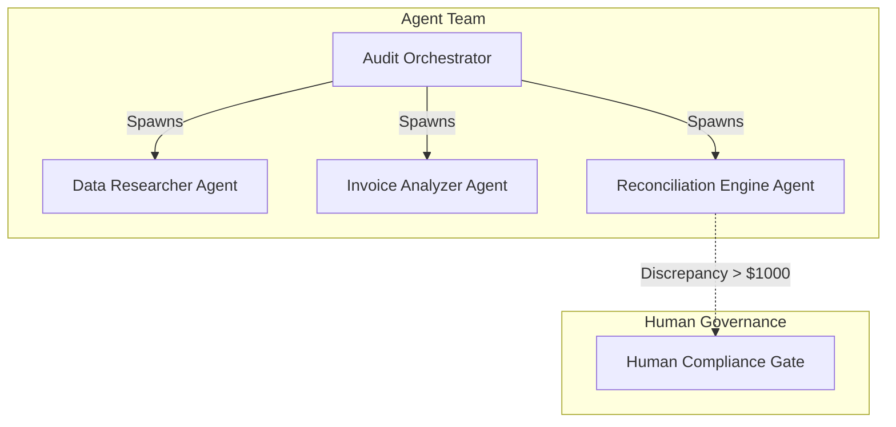
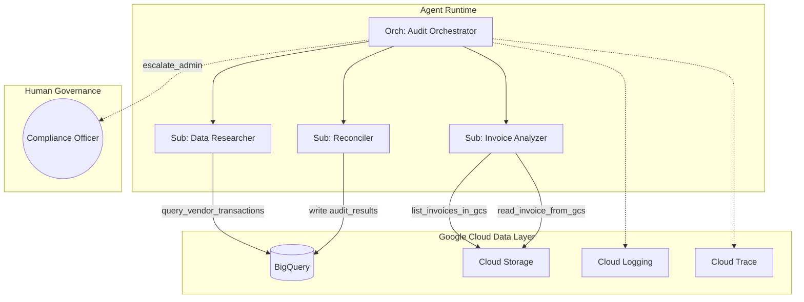
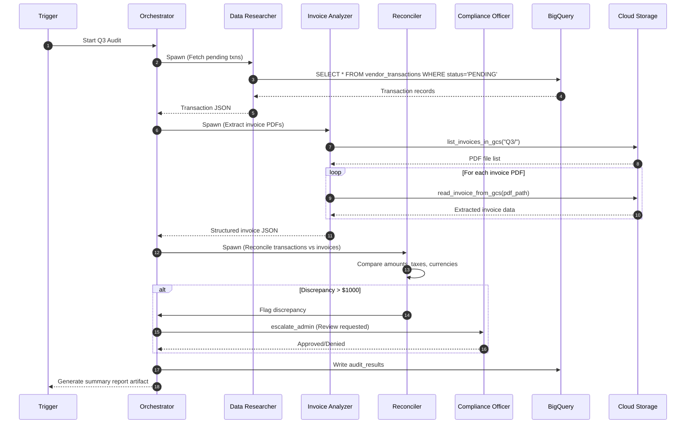
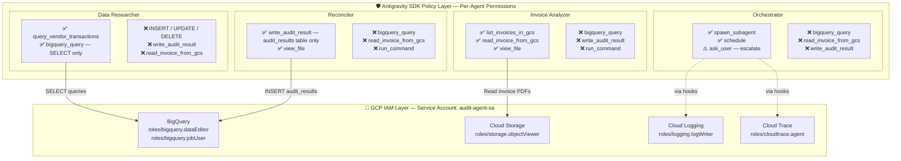

# Hands-On Tutorial: Building an Autonomous Financial Audit Agent Team with Antigravity + Google Cloud
*A complete step-by-step guide to building, testing, and deploying a multi-agent financial reconciliation workflow using the Google Antigravity SDK and Google Cloud Platform.*

---

### Section 1: Overview

**1.1 What You'll Build**

In this tutorial, you will build an autonomous, multi-agent financial audit system capable of reconciling vendor transactions against PDF invoices. Instead of relying on a single large language model prompt, you will architect a team of specialized agents, each with scoped responsibilities, strict security boundaries, and distinct capabilities. 

This agent team consists of:
- **Audit Orchestrator** — The manager. It holds the high-level objective, delegates tasks to subagents, and manages the 4-phase workflow state machine (trigger, gather, reconcile, report).
- **Data Researcher Agent** — A read-only specialist tasked with querying BigQuery for pending vendor transactions.
- **Invoice Analyzer Agent** — A read-only specialist that locates and extracts structured line-item data from PDF invoices stored in Google Cloud Storage (GCS).
- **Reconciliation Engine Agent** — The analytical core. It receives data from the Researcher and Analyzer, matches transactions to invoices, verifies tax calculations, and flags mismatches.
- **Human Compliance Gate** — Not an AI, but a declarative policy hook that pauses execution and escalates any discrepancy above $1,000 to a human compliance officer for manual review before writing results.

Why not just give one agent access to everything? Because a single agent with BigQuery write access, GCS access, and command execution creates an unacceptable blast radius. By organizing the workflow as a multi-agent team, we implement the principle of least privilege, isolate the complex reasoning, and create a verifiable chain of custody for every decision.



**1.2 Prerequisites**
To follow along, you will need:
- A Google Cloud project with billing enabled
- `gcloud` CLI installed and authenticated
- Python 3.11+ with `pip`
- The Antigravity SDK installed (`pip install google-antigravity`)
- Basic familiarity with BigQuery SQL and Python
- A Google Cloud project with Vertex AI API enabled
- `google-cloud-bigquery` Python client library

**1.3 Get the Code and Prepare Sample Data**

The complete source code for this tutorial is available on GitHub. Start by cloning the repository, installing dependencies, and generating the sample invoice PDFs that the agent will process:

```bash
# 1. Clone the repository
git clone https://github.com/rominirani/financial-audit-agent-tutorial.git
cd financial-audit-agent-tutorial

# 2. Create a virtual environment and install dependencies
python -m venv .venv && source .venv/bin/activate
pip install -r requirements.txt

# 3. Generate sample invoice PDFs
python scripts/generate_sample_invoices.py
```

You should see:
```
✅ Generated 4 sample invoice PDFs in /path/to/data/invoices
```

> **❗ Important — Set your project ID before running any code:**
> The codebase reads `PROJECT_ID` from the environment variable. Set it once in your terminal session:
> ```bash
> export PROJECT_ID="your-gcp-project-id"
> ```
> This value is used for BigQuery queries, Cloud Storage bucket naming (`$PROJECT_ID-audit-invoices`), and audit result writes. You will also pass `--project-id=$PROJECT_ID` when running `main.py`.

The script generates 4 invoice PDFs with deliberately planted discrepancies between what the vendor's invoice says and what the ERP system (BigQuery) recorded. This is what the agent must discover:

| Invoice PDF | Vendor | Discrepancy |
|:---|:---|:---|
| `INV-1022-Q3-014.pdf` | OfficeSupplies Co | ✅ Clean match — no discrepancy |
| `INV-8492-Q3-001.pdf` | TechCorp | ❌ Tax rate: invoice says 6.25%, ERP says 8.5% |
| `INV-3301-Q3-099.pdf` | Global Services | ❌ Currency: invoice in EUR, ERP in USD |
| `INV-5567-Q3-001.pdf` | Consulting Group | ❌ Duplicate: 2 ERP records, only 1 PDF |

The repository structure:
```
├── main.py                     # Entry point (Step 5.7)
├── requirements.txt            # Python dependencies
├── agents/                     # Agent configurations (Step 5.4)
│   ├── orchestrator.py
│   ├── data_researcher.py
│   ├── invoice_analyzer.py
│   └── reconciler.py
├── tools/                      # Custom tools — BigQuery + GCS (Step 5.1–5.2)
│   └── bigquery_tools.py
├── hooks/                      # Observability hooks (Step 5.5)
│   └── observability.py
├── policies/                   # Safety policies (Step 5.3)
│   └── audit_policies.py
├── scripts/                    # Data generation
│   └── generate_sample_invoices.py
└── eval/                       # Evaluation (Step 5.8)
    ├── eval_dataset.jsonl
    └── run_eval.py
```

> **💡 Tip:** Clone the [repository](https://github.com/rominirani/financial-audit-agent-tutorial) first and use this tutorial as a guided walkthrough of the code. You'll need to provision the GCP infrastructure in Sections 3–4 before running the agent.

**1.4 Tutorial Approach**
This tutorial uses a fully cloud-native approach with real GCP services: BigQuery, Cloud Storage, Cloud Logging, and Cloud Trace. You will provision real infrastructure and validate results against live data.

---

### Section 2: GCP Services

The enterprise architecture relies on several Google Cloud services to provide data, storage, and observability.

| GCP Service | Role |
|:---|:---|
| **BigQuery** | Transaction data warehouse + audit results |
| **Cloud Storage** (GCS) | Invoice PDF storage |
| **Cloud Logging** | Structured agent audit trail |
| **Cloud Trace** | Distributed tracing across agent calls |
| **IAM** | Least-privilege service accounts |
| **Cloud Run** | Agent deployment target (stretch goal) |

---

### Section 3: Architecture

Understanding the architecture is crucial before writing code. We separate concerns between the Agent Runtime, the Data Layer, and Human Governance.

**Diagram 1 — System Architecture**


**Diagram 2 — Workflow State Machine**


**Diagram 3 — Security Boundary Map: SDK Policies × GCP Services**

This diagram maps two layers of security. The **SDK Policy Layer** controls what each agent can do at the tool level. The **GCP IAM Layer** controls what the service account can access at the infrastructure level. Both must allow an action for it to succeed.



**Security permission matrix — which agent can touch which GCP service:**

| Agent | BigQuery READ | BigQuery WRITE | GCS LIST + READ | Cloud Logging | Cloud Trace |
|:---|:---:|:---:|:---:|:---:|:---:|
| **Orchestrator** | ❌ | ❌ | ❌ | ✅ (via hooks) | ✅ (via hooks) |
| **Data Researcher** | ✅ SELECT only | ❌ | ❌ | ✅ (via hooks) | ✅ (via hooks) |
| **Invoice Analyzer** | ❌ | ❌ | ✅ list + read | ✅ (via hooks) | ✅ (via hooks) |
| **Reconciler** | ❌ | ✅ audit_results only | ❌ | ✅ (via hooks) | ✅ (via hooks) |

> **🔑 Key Insight:** Notice the **defense in depth**. Even if the Data Researcher's LLM were prompt-injected to attempt a `DELETE FROM vendor_transactions`, it would be blocked at *two* levels: the SDK policy engine rejects non-SELECT queries, and the BigQuery IAM role only grants `dataEditor` on the `financial_audit` dataset (not `bigquery.admin`). The Invoice Analyzer can list and read PDFs from GCS but has zero BigQuery access. The Orchestrator itself has no direct data access — it can only delegate to scoped subagents.

The data flow is strictly controlled. The Orchestrator manages state and escalation but does not touch raw data. The Researcher and Analyzer are read-only. The Reconciler can only write to specific output locations.

This illustrates the **principle of least privilege** applied to AI. Each agent's policy represents the MINIMUM set of permissions required for its specific job. The Researcher doesn't need to read PDFs, so it doesn't get GCS access. The Analyzer doesn't need database access, so BigQuery is denied. This compartmentalization ensures that even if an agent hallucinates or is subjected to prompt injection via a malicious invoice PDF, it cannot compromise the broader system.

---

### Section 4: Step-by-Step GCP Provisioning

**Step 4.1: Create Project & Enable APIs**

Start by creating a dedicated GCP project and enabling the six cloud services your agent team will use. Each API corresponds to a specific role: BigQuery for data, Cloud Storage for PDFs, Cloud Logging and Cloud Trace for observability, and Cloud Run for future deployment.

```bash
export PROJECT_ID="financial-audit-tutorial"
gcloud projects create $PROJECT_ID --name="Financial Audit Tutorial"
gcloud config set project $PROJECT_ID
gcloud services enable bigquery.googleapis.com storage.googleapis.com logging.googleapis.com cloudtrace.googleapis.com secretmanager.googleapis.com run.googleapis.com
```

> **💡 Tip:** Ensure your GCP project has billing linked using `gcloud billing projects link $PROJECT_ID --billing-account=YOUR_ACCOUNT_ID`. Also, all `gcloud` commands in this section assume you have already authenticated using `gcloud auth login`.

**Step 4.2: Create BigQuery Dataset & Tables**

We only create two tables: `vendor_transactions` (the ERP source of truth) and `audit_results` (where the agent writes findings). Invoice data is **not** pre-loaded into BigQuery — the agent extracts it from PDF files stored in GCS.

```bash
bq mk --dataset $PROJECT_ID:financial_audit

# Create vendor_transactions — the ERP source of truth
bq mk --table $PROJECT_ID:financial_audit.vendor_transactions \
vendor_id:STRING,vendor_name:STRING,invoice_num:STRING,amount:FLOAT64,currency:STRING,tax_rate:FLOAT64,status:STRING,quarter:STRING,transaction_date:DATE

# Create audit_results — the agent writes its findings here
bq mk --table $PROJECT_ID:financial_audit.audit_results \
execution_id:STRING,vendor_id:STRING,invoice_num:STRING,transaction_amount:FLOAT64,invoice_amount:FLOAT64,discrepancy_amount:FLOAT64,status:STRING,agent_notes:STRING,reviewed_by:STRING,timestamp:TIMESTAMP
```

> **📝 Note:** We intentionally plant discrepancies between the transaction records (BigQuery) and the invoice PDFs (GCS) to test the agent's analytical capabilities:
> - **Vendor 8492**: The ERP transaction records $142,300 at 8.5% tax, but the vendor's PDF invoice shows $138,750 at 6.25% tax.
> - **Vendor 3301**: The ERP transaction is recorded in USD, but the vendor's PDF invoice is denominated in EUR.
> - **Vendor 5567**: The ERP has two transactions with the same invoice number but different amounts ($23,400 and $24,100), while only one PDF invoice exists.
> 
> The agent must discover these discrepancies by reading both data sources — it is never told where the errors are.

Populate the transactions table with ERP data. These represent what your company's accounting system has recorded — amounts, tax rates, currencies, and invoice numbers. Think of this as the "source of truth" from the internal financial system:
```sql
-- Run this in the BigQuery Console or via: bq query --use_legacy_sql=false '...'
INSERT INTO `'$PROJECT_ID'.financial_audit.vendor_transactions`
(vendor_id, vendor_name, invoice_num, amount, currency, tax_rate, status, quarter, transaction_date) VALUES
('8492', 'TechCorp Solutions', 'INV-8492-Q3-001', 142300.00, 'USD', 0.085, 'PENDING', 'Q3', '2026-07-15'),
('1022', 'OfficeSupplies Co', 'INV-1022-Q3-014', 4500.00, 'USD', 0.05, 'PENDING', 'Q3', '2026-07-20'),
('3301', 'Global Services Ltd', 'INV-3301-Q3-099', 87500.00, 'USD', 0.10, 'PENDING', 'Q3', '2026-08-01'),
('5567', 'Consulting Group Inc', 'INV-5567-Q3-001', 23400.00, 'USD', 0.0, 'PENDING', 'Q3', '2026-08-10'),
('5567', 'Consulting Group Inc', 'INV-5567-Q3-001', 24100.00, 'USD', 0.0, 'PENDING', 'Q3', '2026-08-12');
```

**Step 4.3: Create GCS Bucket and Upload Invoice PDFs**

If you followed Section 1.3, you already have 4 sample invoice PDFs in `data/invoices/`. Now create a Cloud Storage bucket and upload them. The `-l us-central1` flag co-locates the bucket with your BigQuery dataset for low-latency access:

```bash
# Create a regional bucket for invoice PDFs
gsutil mb -l us-central1 gs://$PROJECT_ID-audit-invoices

# Upload all generated invoices into a Q3/ prefix
gsutil -m cp data/invoices/*.pdf gs://$PROJECT_ID-audit-invoices/Q3/

# Verify uploads — you should see 4 PDF files
gsutil ls gs://$PROJECT_ID-audit-invoices/Q3/
```

> **💡 Tip:** The `Q3/` prefix organizes invoices by quarter. The agent's `list_invoices_in_gcs()` tool filters by this prefix when searching for invoices to reconcile.


**Step 4.4: Create Service Account with Least-Privilege IAM**

Create a dedicated service account for the audit agent and grant it only the minimum IAM roles required. Each role maps to a specific capability: `dataViewer` for reading BigQuery tables, `jobUser` for running queries, `logWriter` for writing structured audit logs, `cloudtrace.agent` for publishing trace spans, and `storage.objectViewer` for reading invoice PDFs from GCS. The agent cannot delete data, modify tables, or access other projects.

```bash
# Create the service account
gcloud iam service-accounts create audit-agent-sa \
    --display-name="Audit Agent Service Account"

SA_EMAIL="audit-agent-sa@$PROJECT_ID.iam.gserviceaccount.com"

# BigQuery: read transactions + write audit results
gcloud projects add-iam-policy-binding $PROJECT_ID \
    --member="serviceAccount:$SA_EMAIL" \
    --role="roles/bigquery.dataViewer" --condition=None
gcloud projects add-iam-policy-binding $PROJECT_ID \
    --member="serviceAccount:$SA_EMAIL" \
    --role="roles/bigquery.jobUser" --condition=None

# Cloud Logging: write structured audit events
gcloud projects add-iam-policy-binding $PROJECT_ID \
    --member="serviceAccount:$SA_EMAIL" \
    --role="roles/logging.logWriter" --condition=None

# Cloud Trace: publish distributed trace spans
gcloud projects add-iam-policy-binding $PROJECT_ID \
    --member="serviceAccount:$SA_EMAIL" \
    --role="roles/cloudtrace.agent" --condition=None

# Cloud Storage: read-only access to invoice PDFs
gcloud projects add-iam-policy-binding $PROJECT_ID \
    --member="serviceAccount:$SA_EMAIL" \
    --role="roles/storage.objectViewer" --condition=None
```

> **💡 Tip:** The `--condition=None` flag is required when your project already has conditional IAM policies. Without it, the command will fail with a `"Adding a binding without specifying a condition is prohibited"` error.


**Step 4.5: Verify Setup**

Before writing any code, verify that all infrastructure was provisioned correctly. These two commands confirm the BigQuery dataset exists and the service account has the expected IAM roles:

```bash
# Verify BigQuery dataset and tables exist
bq ls $PROJECT_ID:financial_audit

# Verify IAM roles assigned to the service account
gcloud projects get-iam-policy $PROJECT_ID \
  --flatten="bindings[].members" \
  --format='table(bindings.role)' \
  --filter="bindings.members:audit-agent-sa"
```

You should see `roles/bigquery.dataViewer`, `roles/bigquery.jobUser`, `roles/logging.logWriter`, `roles/cloudtrace.agent`, and `roles/storage.objectViewer` in the output.

---

### Section 5: Antigravity SDK Code — Step by Step

**Step 5.1: Clone the Repository and Install Dependencies**

Clone the repository, set up a Python virtual environment, and install the dependencies. `google-antigravity` is the SDK itself; `google-cloud-bigquery` and `google-cloud-storage` provide the GCP client libraries your tools will wrap; `reportlab` generates sample invoice PDFs; and `PyPDF2` enables PDF text extraction at runtime:

```bash
git clone https://github.com/rominirani/financial-audit-agent-tutorial.git
cd financial-audit-agent-tutorial
python -m venv .venv && source .venv/bin/activate
pip install -r requirements.txt
```

**Step 5.2: Define Custom Tools**

Agents need tools to interact with external systems. In this tutorial, we define custom Python functions that wrap the Google Cloud client libraries (`google-cloud-bigquery` and `google-cloud-storage`) and pass them to the agent via the `tools` parameter in `LocalAgentConfig`.

| Tool | Purpose | Assigned To |
|:---|:---|:---|
| `query_vendor_transactions()` | Query BigQuery for pending transactions | Data Researcher, Orchestrator |
| `list_invoices_in_gcs()` | List all invoice PDFs in the GCS bucket | Invoice Analyzer |
| `read_invoice_from_gcs()` | Read and extract structured data from an invoice PDF | Invoice Analyzer |
| `write_audit_result()` | Write reconciliation results to BigQuery | Reconciler, Orchestrator |

Each tool is a standard Python function with type hints and a descriptive docstring. The SDK automatically registers them as callable tools the agent can invoke — the agent sees a list of available functions with descriptions and calls them as needed.

**Step 5.2b: Implement the Tools** (`tools/bigquery_tools.py`)

This file contains all four tool functions. Each function wraps a Google Cloud client library call and returns a JSON string that the agent can parse and reason over.

```python
from google.cloud import bigquery, storage
import json
import os

PROJECT_ID = os.environ.get("PROJECT_ID", "YOUR_PROJECT_ID")
DATASET = "financial_audit"
BUCKET_NAME = f"{PROJECT_ID}-audit-invoices"

_client = bigquery.Client(project=PROJECT_ID)


def query_vendor_transactions(quarter: str = "Q3") -> str:
    """Query BigQuery for all PENDING vendor transactions in a given quarter."""
    query = f"""
    SELECT vendor_id, vendor_name, invoice_num, amount, currency, tax_rate, status, quarter, transaction_date
    FROM `{PROJECT_ID}.{DATASET}.vendor_transactions`
    WHERE status = 'PENDING' AND quarter = '{quarter}'
    ORDER BY vendor_id, invoice_num
    """
    rows = _client.query(query).result()
    results = [{"vendor_id": row.vendor_id, "amount": row.amount, ...} for row in rows]
    return json.dumps({"total_transactions": len(results), "transactions": results}, indent=2)


def list_invoices_in_gcs(bucket_name: str, prefix: str = "Q3/") -> str:
    """List all invoice PDF files in a Google Cloud Storage bucket."""
    ...


def read_invoice_from_gcs(bucket_name: str, blob_name: str) -> str:
    """Read and extract structured data from an invoice PDF stored in GCS."""
    ...


def write_audit_result(vendor_id: str, invoice_num: str, status: str, ...) -> str:
    """Write an audit reconciliation result to the BigQuery audit_results table."""
    ...


AUDIT_TOOLS = [query_vendor_transactions, list_invoices_in_gcs, read_invoice_from_gcs, write_audit_result]
```

> 📎 See the complete implementation with all four tools: [bigquery_tools.py](https://github.com/rominirani/financial-audit-agent-tutorial/blob/main/tools/bigquery_tools.py)

These four functions give the agent typed, documented tools with clear input/output contracts. The `read_invoice_from_gcs` tool downloads the PDF, extracts text using PyPDF2, and parses structured fields (amounts, tax rates, currency) via regex. The agent never sees raw PDF bytes — it receives clean JSON.

> **💡 Tip:** Install PyPDF2 for PDF text extraction: `pip install PyPDF2`. Each tool function's docstring becomes the tool's description visible to the LLM. Write clear, specific docstrings — they directly affect the agent's ability to choose the right tool.

**Step 5.3: Define Safety Policies** (`policies/audit_policies.py`)

Safety policies are the SDK's mechanism for controlling what agents can and cannot do. Each policy tier represents a different level of trust. The key difference: **staging** requires a human at the terminal to approve writes, while **production** runs fully autonomously with argument-level validation. The `compliance_officer_approval_handler` simulates a human gate — in a real deployment, you'd replace the `input()` call with a Slack notification or approval workflow:

```python
from google.antigravity.hooks import policy

VALID_STATUSES = {"MATCHED", "DISCREPANCY", "ESCALATED", "UNMATCHED"}

async def compliance_officer_approval_handler(tool_call) -> bool:
    """Escalation handler for high-risk actions in staging.

    Receives a types.ToolCall object. Use tool_call.name for the tool name
    and tool_call.args for the arguments dict.
    """
    print(f"\n🚨 ESCALATION REQUIRED 🚨")
    print(f"Action requested: {tool_call.name}")
    print(f"Arguments: {tool_call.args}")

    # In a real environment, this would ping Slack/Email and wait.
    # For this tutorial, we simulate a prompt.
    response = input("Compliance Officer, approve this action? (y/n): ")
    return response.lower() == 'y'


# --- Development: full permissions, no restrictions ---
DEVELOPMENT_POLICIES = [
    policy.allow_all(),
]


# --- Staging: reads auto-allowed, writes require human approval ---
# Use this when testing interactively. You sit at the terminal and
# approve/reject each write_audit_result call before it hits BigQuery.
STAGING_POLICIES = [
    policy.deny_all(),
    # Read-only tools — allowed without approval
    policy.allow("query_vendor_transactions"),
    policy.allow("list_invoices_in_gcs"),
    policy.allow("read_invoice_from_gcs"),
    # Write tools — human must approve each one
    policy.ask_user("write_audit_result", handler=compliance_officer_approval_handler),
]


# --- Production: fully autonomous, no human prompts ---
# Use this for unattended execution (Cloud Run, cron jobs).
# Writes are auto-allowed but ONLY if the status is valid.
# No ask_user — there's no human at the terminal in production.
PRODUCTION_POLICIES = [
    policy.deny_all(),
    # Read-only tools — allowed
    policy.allow("query_vendor_transactions"),
    policy.allow("list_invoices_in_gcs"),
    policy.allow("read_invoice_from_gcs"),
    # Write tools — auto-allowed but only with valid status values
    policy.allow("write_audit_result",
                 when=lambda args: args.get("status", "") in VALID_STATUSES,
                 name="allow_valid_audit_writes"),
]
```

Notice the three distinct policy tiers and the critical difference between staging and production:
- **DEVELOPMENT_POLICIES**: Uses `allow_all()`, meaning the agent can do anything. Use this *only* on your local machine for rapid iteration and debugging.
- **STAGING_POLICIES**: Reads are auto-allowed, but `write_audit_result` triggers the `compliance_officer_approval_handler` which pauses the agent and prompts you via `stdin`. You review the vendor ID, status, and amounts before approving each write.
- **PRODUCTION_POLICIES**: Designed for unattended execution on Cloud Run or cron. There's no `ask_user` (nobody is at the terminal). Instead, writes are auto-allowed but **only** if the `status` argument is a valid value (`MATCHED`, `DISCREPANCY`, `ESCALATED`, or `UNMATCHED`). Any hallucinated or malformed status is silently denied.

> **⚠️ Important:** Policy tool names must match the **registered function names** — not generic categories. Since our tools are `query_vendor_transactions`, `list_invoices_in_gcs`, `read_invoice_from_gcs`, and `write_audit_result`, those are the exact strings used in `policy.allow()` and `policy.ask_user()`. Using wrong names (e.g., `bigquery_query`) would cause a silent mismatch and the tool would be denied by `deny_all()`.

**Step 5.4: Define the Agent Team**

Each agent in the team gets its own configuration file defining its system instructions (the "job description"), permitted tools, and security policies. The Antigravity SDK uses `LocalAgentConfig` for subagents and `CapabilitiesConfig` to control whether an agent can spawn other agents.

`agents/orchestrator.py` — The lead auditor. It holds the high-level workflow, has access to all tools, and can spawn subagents. Notice how the system instructions are highly directive — they include the concrete bucket name, exact tool call syntax for each step, and explicit instructions to not stop partway through:
```python
from google.antigravity import LocalAgentConfig, CapabilitiesConfig
from tools.bigquery_tools import AUDIT_TOOLS, BUCKET_NAME

def get_orchestrator_config(policies, workspace, project_id=None, quarter="Q3"):
    return LocalAgentConfig(
        system_instructions=f"""
        You are the Lead Financial Auditor. You MUST complete the entire reconciliation
        workflow in a single session. Do NOT stop partway through.

        GCS BUCKET: {BUCKET_NAME}
        QUARTER: {quarter}

        WORKFLOW — execute ALL steps before producing your final report:

        STEP 1: Call query_vendor_transactions(quarter="{quarter}") to get all PENDING
                transactions from BigQuery.

        STEP 2: Call list_invoices_in_gcs() to list all invoice PDFs in the GCS bucket.

        STEP 3: For EACH invoice PDF returned in Step 2, call read_invoice_from_gcs()
                with the invoice_path (e.g. "Q3/INV-8492-Q3-001.pdf").
                Extract: vendor_id, invoice_num, base_amount, tax_rate, total_amount, currency.

        STEP 4: RECONCILE each transaction (Step 1) against its corresponding invoice (Step 3).
                Match by vendor_id and invoice_num. For each pair:
                - Compare transaction amount vs invoice total_amount (tolerance: $0.01)
                - Verify tax_rate matches
                - Check currency consistency
                - Classify as MATCHED, DISCREPANCY, or UNMATCHED

        STEP 5: For each reconciled pair, call write_audit_result() to record the finding.
                If any discrepancy exceeds $1,000, set status to ESCALATED.

        STEP 6: Produce a FINAL COMPLIANCE REPORT summarizing:
                - Total vendors audited
                - Number of matches vs discrepancies
                - Details of each discrepancy (vendor, amount difference, cause)
                - Escalation recommendations

        CRITICAL RULES:
        - You MUST call read_invoice_from_gcs() for EVERY invoice — do not skip any
        - Never modify the vendor_transactions table directly
        - Always escalate discrepancies over $1,000 — do not auto-approve
        - Log every decision with a clear rationale
        - Do NOT stop after listing invoices — you must read, reconcile, and report
        """,
        tools=AUDIT_TOOLS,
        capabilities=CapabilitiesConfig(enable_subagents=True),
        model="gemini-2.5-flash",
        policies=policies,
        workspaces=[workspace],
        vertex=True if project_id else None,
        project=project_id,
        location="us-central1" if project_id else None,
    )

**What's happening here:**
- **Directive system instructions** — The model is told explicitly what to do at each step AND told not to stop partway. This is critical for multi-step tool calling — vague instructions cause the model to halt after the first round.
- `BUCKET_NAME` — Injected from the config constant so the model never has to guess the GCS bucket name.
- `tools=AUDIT_TOOLS` — Passes the custom BigQuery/GCS functions as callable tools.
- `vertex=True` — Routes API calls through Vertex AI using Application Default Credentials (ADC).
- `CapabilitiesConfig(enable_subagents=True)` — Authorizes this agent to dynamically spawn child agents.
```

`agents/data_researcher.py` — The BigQuery specialist. It has a single allowed operation: run SELECT queries. The policy uses a `when` lambda to inspect the query string at runtime, ensuring only SELECT statements pass. Any INSERT, UPDATE, or DELETE attempt is denied before it reaches BigQuery:
```python
from google.antigravity import LocalAgentConfig
from google.antigravity.hooks import policy

def get_data_researcher_config(workspace):
    return LocalAgentConfig(
        system_instructions="""
        You are a Data Research Specialist. Your job is to query BigQuery
        for vendor transaction records. You have READ-ONLY access.
        
        Return results as a structured JSON summary with:
        - Total transactions found
        - List of vendor_id, invoice_num, amount, currency, tax_rate
        - Any data quality issues noted
        """,
        policies=[
            policy.deny_all(),
            policy.allow("bigquery_query",
                         when=lambda args: args.get("Query", "").strip().upper().startswith("SELECT"),
                         name="allow_bq_select_only"),
        ],
        workspaces=[workspace],
    )
```

`agents/invoice_analyzer.py` — The PDF extraction specialist. It can list and read files but has **zero** BigQuery access. Its system instructions tell it to enumerate GCS PDFs and extract structured data from each one. Even if this agent were compromised via a malicious PDF, it cannot touch the database:
```python
from google.antigravity import LocalAgentConfig
from google.antigravity.hooks import policy

def get_invoice_analyzer_config(workspace):
    return LocalAgentConfig(
        system_instructions="""
        You are an Invoice Analysis Specialist. Your job is to:
        1. List all invoice PDFs in the GCS bucket using list_invoices_in_gcs()
        2. Read each PDF using read_invoice_from_gcs() to extract structured data
        
        For each invoice, extract and return:
        - Vendor name and ID
        - Invoice number
        - Base amount, tax rate, tax amount
        - Total invoice amount
        - Currency
        
        Return results as structured JSON.
        """,
        policies=[
            policy.deny_all(),
            policy.allow("view_file"),
            policy.allow("list_dir"),
        ],
        workspaces=[workspace],
    )
```

`agents/reconciler.py` — The analytical core. It receives pre-fetched data from the other agents and performs the comparison logic. Its policies restrict it to `view_file` only — it cannot query databases or access GCS directly. The Orchestrator passes it the data it needs:
```python
from google.antigravity import LocalAgentConfig
from google.antigravity.hooks import policy

def get_reconciler_config(workspace):
    return LocalAgentConfig(
        system_instructions="""
        You are a Reconciliation Engine. You receive two datasets:
        1. Transaction records from BigQuery
        2. Invoice data extracted from PDFs
        
        For each transaction-invoice pair:
        - Match by vendor_id and invoice_num
        - Compare transaction amount vs invoice amount (tolerance: $0.01)
        - Verify tax rate calculations
        - Check currency consistency
        
        Classify each pair as:
        - MATCHED: amounts match within tolerance
        - DISCREPANCY: amounts differ — include the difference and likely cause
        - UNMATCHED: transaction exists but no corresponding invoice found
        
        Flag any discrepancy exceeding $1,000 for human escalation.
        """,
        policies=[
            policy.deny_all(),
            policy.allow("view_file"),
        ],
        workspaces=[workspace],
    )
```

Notice the progression of trust across the team. The Orchestrator has broad administrative authority to spawn subagents and orchestrate the workflow but doesn't directly touch the raw data. As we move to the Researcher, Analyzer, and Reconciler, the permissions narrow significantly. They are granted only the precise read or write access required for their specific analytical tasks, encapsulating the complex reasoning in isolated, secure sandboxes.

**Step 5.5: Implement Observability Hooks** (`hooks/observability.py`)

Hooks are the SDK's mechanism for injecting cross-cutting concerns — logging, tracing, alerting — into the agent lifecycle without modifying the agent's core logic. We implement three hooks that integrate with **Cloud Logging** and **Cloud Trace** for production observability, while also printing to the console for local development.

```python
from google.antigravity.hooks import on_session_start, post_tool_call, on_session_end
from google.antigravity import types
from opentelemetry import trace
# ... Cloud Logging and Cloud Trace setup (see full file for details) ...

AGENT_NAME = "audit-orchestrator"
_active_span = None
_tool_call_count = 0


@on_session_start
async def audit_session_start():
    global _active_span, _tool_call_count
    _tool_call_count = 0
    _log("INFO", "Audit session started", event="SESSION_START", agent=AGENT_NAME)

    if CLOUD_TRACE_ENABLED:
        _active_span = _tracer.start_span("financial-audit-session")
        _active_span.set_attribute("audit.type", "vendor-reconciliation")
        _active_span.set_attribute("agent.name", AGENT_NAME)


@post_tool_call
async def audit_tool_invocation(data: types.ToolResult):
    """Create a child span explicitly parented under the session span."""
    global _tool_call_count
    _tool_call_count += 1
    tool_name = data.name if hasattr(data, 'name') else str(data)

    _log("INFO", f"Tool invoked: {tool_name}",
         event="TOOL_INVOCATION", agent=AGENT_NAME, tool=tool_name)

    if CLOUD_TRACE_ENABLED and _tracer and _active_span:
        # Key: set_span_in_context() parents tool spans under session span
        parent_ctx = trace.set_span_in_context(_active_span)
        tool_span = _tracer.start_span(f"tool:{tool_name}", context=parent_ctx)
        tool_span.set_attribute("tool.name", tool_name)
        tool_span.set_attribute("tool.call_index", _tool_call_count)
        tool_span.end()


# @on_session_end closes the session span and logs total_tool_calls

AUDIT_HOOKS = [audit_session_start, audit_tool_invocation, audit_session_end]
```

> 📎 See the full implementation with Cloud Logging/Trace setup and graceful degradation: [observability.py](https://github.com/rominirani/financial-audit-agent-tutorial/blob/main/hooks/observability.py)

**What each hook does:**
- `@on_session_start` — Fires when the agent session begins. Creates a root Cloud Trace span and logs the start event to Cloud Logging.
- `@post_tool_call` — Fires after every tool invocation. Receives a `types.ToolResult` object. Logs the tool name and `AGENT_NAME` to Cloud Logging. Creates a child span explicitly parented under the session span using `trace.set_span_in_context()` — this is what makes tool spans appear nested in the Cloud Trace waterfall.
- `@on_session_end` — Fires when the session ends. Records `total_tool_calls`, closes the trace span, and logs the completion event.

> **💡 Tip:** The hooks use graceful degradation — if `google-cloud-logging` or `opentelemetry` aren't installed, they fall back to console-only output. This means the same code works in both local development and production without conditional imports.

To enable Cloud Logging and Cloud Trace, install the additional dependencies:
```bash
pip install google-cloud-logging opentelemetry-api opentelemetry-sdk opentelemetry-exporter-gcp-trace
```

**Step 5.6: Generate Sample Invoice PDFs** (`scripts/generate_sample_invoices.py`)

> **📝 Note:** If you already ran this script and uploaded the PDFs in Step 4.3, you can skip ahead to Step 5.7. This section explains the code for reference.

This script uses the `reportlab` library to generate realistic-looking invoice PDFs with structured text fields. Each PDF contains the invoice number, vendor name and ID, base amount, tax rate, tax amount, and total — formatted so that our `read_invoice_from_gcs()` tool can parse them via regex.

The key design decision is the **planted discrepancies** between these invoices and the BigQuery transaction records from Step 4.2. This is what gives the agent something meaningful to discover:

| Vendor | Discrepancy Type | ERP (BigQuery) | Invoice (PDF) |
|:---|:---|:---|:---|
| 8492 (TechCorp) | Tax rate mismatch | $142,300 at 8.5% | $138,750 at 6.25% |
| 3301 (Global Services) | Currency mismatch | USD | EUR |
| 5567 (Consulting Group) | Duplicate invoice | 2 transactions ($23,400 + $24,100) | 1 PDF ($23,400) |
| 1022 (OfficeSupplies Co) | Clean match | $4,500 at 5% | $4,500 at 5% |

```python
from reportlab.pdfgen import canvas

def create_invoice(vendor_id, vendor_name, inv_num, amount, currency, tax_rate, output_dir):
    """Generate a single invoice PDF with structured text fields."""
    ...

# Normal — matches ERP exactly
create_invoice('1022', 'OfficeSupplies Co', 'INV-1022-Q3-014', 4500.00, 'USD', 0.05, '../data/invoices')
# Planted discrepancy 1: Tax calculation error (invoice shows 6.25% instead of 8.5%)
create_invoice('8492', 'TechCorp', 'INV-8492-Q3-001', 138750.00, 'USD', 0.0625, '../data/invoices')
# Planted discrepancy 2: Currency mismatch (invoice in EUR, ERP in USD)
create_invoice('3301', 'Global Services', 'INV-3301-Q3-099', 87500.00, 'EUR', 0.10, '../data/invoices')
# Planted discrepancy 3: Duplicate (one PDF, two ERP records at different amounts)
create_invoice('5567', 'Consulting Group', 'INV-5567-Q3-001', 23400.00, 'USD', 0.0, '../data/invoices')
```

> 📎 See the full script: [generate_sample_invoices.py](https://github.com/rominirani/financial-audit-agent-tutorial/blob/main/scripts/generate_sample_invoices.py)

To run this script and upload the generated PDFs to Cloud Storage, follow the instructions in **Step 4.3**.

**Step 5.7: Write the Main Orchestration Script** (`main.py`)

This is the entry point that ties everything together. It parses command-line arguments to select the policy tier (dev/staging/prod), loads the corresponding policy set, configures the Orchestrator agent with Vertex AI credentials and observability hooks, and sends the initial audit prompt. The `async with Agent(config)` context manager handles the agent lifecycle (connection, execution, cleanup):
```python
import asyncio
import argparse
import os
from google.antigravity import Agent
from agents.orchestrator import get_orchestrator_config
from policies.audit_policies import DEVELOPMENT_POLICIES, STAGING_POLICIES, PRODUCTION_POLICIES
from hooks.observability import AUDIT_HOOKS

async def main():
    parser = argparse.ArgumentParser(description="Financial Audit Agent Team")
    parser.add_argument("--mode", choices=["dev", "staging", "prod"], default="dev")
    parser.add_argument("--quarter", default="Q3")
    parser.add_argument("--project-id", default=None, help="GCP project ID for Vertex AI")
    args = parser.parse_args()
    
    # Select policy set
    policies = {
        "dev": DEVELOPMENT_POLICIES,
        "staging": STAGING_POLICIES,
        "prod": PRODUCTION_POLICIES,
    }[args.mode]
    
    workspace_dir = os.path.abspath(os.path.dirname(__file__))
    
    # Build orchestrator config
    config = get_orchestrator_config(
        policies=policies,
        workspace=workspace_dir,
        project_id=args.project_id,
        quarter=args.quarter,
    )
    config.hooks = AUDIT_HOOKS

    print(f"🚀 Starting Financial Audit — Mode: {args.mode}, Quarter: {args.quarter}")
    print(f"📋 Policies: {len(policies)} rules loaded")
    print(f"🔗 Vertex AI: {args.project_id}\n")
    
    async with Agent(config) as agent:
        response = await agent.chat(
            f"Execute the full {args.quarter} vendor invoice reconciliation now. "
            f"Complete ALL steps: query transactions, list invoices, read EVERY invoice PDF, "
            f"reconcile each transaction against its invoice, write audit results, "
            f"and produce the final compliance report. Do not stop until the report is complete."
        )
        
        # Print the agent's response
        print("\n" + "=" * 60)
        print("📊 AUDIT RESULTS")
        print("=" * 60)
        print(await response.text())
        
        # Token usage summary
        usage = agent.conversation.total_usage
        print(f"\n💰 Token Usage Summary:")
        print(f"   Prompt tokens:    {usage.prompt_token_count}")
        print(f"   Output tokens:    {usage.candidates_token_count}")
        print(f"   Thinking tokens:  {usage.thoughts_token_count}")
        print(f"   Total tokens:     {usage.total_token_count}")

if __name__ == "__main__":
    asyncio.run(main())
```

> **🔑 Key Insight:** The `--project-id` flag specifies the GCP project for Vertex AI. In CI/CD pipelines, set this via environment variables. The `config.hooks = AUDIT_HOOKS` line enables observability for the entire agent hierarchy.

**Step 5.8: Evaluate the Agent**

Evaluations let you systematically test the agent against known scenarios to catch regressions. The repo includes two files: a dataset of test cases and a runner script.

**5.8a: The Evaluation Dataset** — `eval/eval_dataset.jsonl`

Each line is a JSON object with three fields: `input` (the prompt to send), `expected_outcome` (keywords the response must contain), and `expected_tools` (which tools should be invoked):

```jsonl
{"input": "Reconcile vendor 8492 for Q3.", "expected_outcome": "discrepancy, tax, escalat", "expected_tools": ["query_vendor_transactions", "list_invoices_in_gcs", "read_invoice_from_gcs"]}
{"input": "Reconcile vendor 1022 for Q3.", "expected_outcome": "match", "expected_tools": ["query_vendor_transactions", "list_invoices_in_gcs", "read_invoice_from_gcs"]}
{"input": "Reconcile vendor 3301 for Q3.", "expected_outcome": "currency, mismatch, EUR", "expected_tools": ["query_vendor_transactions", "list_invoices_in_gcs", "read_invoice_from_gcs"]}
{"input": "Reconcile vendor 5567 for Q3.", "expected_outcome": "duplicate, invoice", "expected_tools": ["query_vendor_transactions", "list_invoices_in_gcs", "read_invoice_from_gcs"]}
```

**5.8b: The Eval Runner Script** — `eval/run_eval.py`

This script loads the dataset, sends each test case to the agent, and checks whether the expected keywords appear in the response. It reuses the same `Agent` API and orchestrator config from `main.py`:

```python
async def run_eval(eval_file: str, project_id: str):
    """Run each eval case and check agent output against expected keywords."""
    with open(eval_file) as f:
        cases = [json.loads(line) for line in f if line.strip()]

    config = get_orchestrator_config(
        policies=DEVELOPMENT_POLICIES, workspace=workspace_dir, project_id=project_id,
    )
    config.hooks = AUDIT_HOOKS

    passed = 0
    async with Agent(config) as agent:
        for case in cases:
            response = await agent.chat(case["input"])
            result = await response.text()

            # Check if ALL expected keywords appear in the response
            keywords = [kw.strip().lower() for kw in case["expected_outcome"].split(",")]
            missing = [kw for kw in keywords if kw not in result.lower()]

            if not missing:
                print(f"✅ PASS")
                passed += 1
            else:
                print(f"❌ FAIL — missing keywords: {missing}")
```

> 📎 See the full eval runner with CLI argument parsing: [run_eval.py](https://github.com/rominirani/financial-audit-agent-tutorial/blob/main/eval/run_eval.py)

**5.8c: Run the Evaluations**

```bash
python eval/run_eval.py --project-id=$PROJECT_ID
```

Expected output:
```
📋 Loaded 4 eval cases from eval/eval_dataset.jsonl

--- Eval Case 1/4: Reconcile vendor 8492 for Q3. ---
✅ PASS

--- Eval Case 2/4: Reconcile vendor 1022 for Q3. ---
✅ PASS

--- Eval Case 3/4: Reconcile vendor 3301 for Q3. ---
✅ PASS

--- Eval Case 4/4: Reconcile vendor 5567 for Q3. ---
✅ PASS

============================================================
📊 EVAL RESULTS: 4/4 passed, 0/4 failed
============================================================
```

If a case fails, the runner prints which keywords were missing and a preview of the agent's actual response, so you can debug the prompt:

```
--- Eval Case 1/4: Reconcile vendor 8492 for Q3. ---
❌ FAIL — missing keywords: ['escalat']
   Response preview: Found a tax rate discrepancy for vendor 8492. The ERP records 8.5% ...
```

> **💡 Tip:** Run evals after every prompt or tool change. The most common regression is the agent using different wording (e.g., "flagged for review" instead of "escalated"), which you can fix by adding more keyword variants to `expected_outcome` or by refining the system instructions.

**Step 5.9: Run the Agent**

Before running, confirm all the prerequisites from earlier steps are in place:

- [ ] `PROJECT_ID` environment variable is set (`export PROJECT_ID="your-project-id"`) — Section 1.3
- [ ] Sample invoice PDFs generated in `data/invoices/` — Section 1.3
- [ ] BigQuery dataset `financial_audit` with both tables created and populated — Step 4.2
- [ ] GCS bucket `gs://$PROJECT_ID-audit-invoices` with invoice PDFs uploaded to `Q3/` — Step 4.3
- [ ] Service account created with least-privilege IAM roles — Step 4.4
- [ ] Virtual environment activated with all dependencies installed — Section 1.3

Run the agent with:

```bash
python main.py --mode=dev --quarter=Q3 --project-id=$PROJECT_ID
```

The command accepts three flags:

| Flag | Description |
|:---|:---|
| `--mode` | Policy tier: `dev` (permissive), `staging` (human-in-the-loop), or `prod` (locked down) |
| `--quarter` | Fiscal quarter to audit (matches the GCS prefix and BigQuery `quarter` field) |
| `--project-id` | Your GCP project ID for Vertex AI model access |

Try each policy tier to see how the SDK's policy system changes agent behavior:

Try each policy tier to see how the SDK's policy system changes agent behavior:

**5.9a: Development Mode** (`--mode=dev`)

Development mode uses `allow_all()` — the agent has full, unrestricted permissions. This is ideal for debugging prompt logic and verifying the end-to-end workflow:

```bash
python main.py --mode=dev --quarter=Q3 --project-id=$PROJECT_ID
```

The agent runs without interruption — freely querying BigQuery, spawning subagents, reading PDFs from GCS, and writing results. Here is what a successful dev run looks like:

```
🚀 Starting Financial Audit — Mode: dev, Quarter: Q3
📋 Policies: 1 rules loaded
🔗 Vertex AI: $PROJECT_ID

============================================================
🔍 FINANCIAL AUDIT SESSION STARTED — 2026-07-30T04:16:24Z
============================================================

[AUDIT] {"timestamp": "2026-07-30T04:16:24Z", "severity": "INFO", "message": "Audit session started", "event": "SESSION_START"}
[AUDIT] {"timestamp": "2026-07-30T04:16:26Z", "severity": "INFO", "message": "Tool invoked: query_vendor_transactions", "event": "TOOL_INVOCATION"}
[AUDIT] {"timestamp": "2026-07-30T04:16:28Z", "severity": "INFO", "message": "Tool invoked: list_invoices_in_gcs", "event": "TOOL_INVOCATION"}
[AUDIT] {"timestamp": "2026-07-30T04:16:30Z", "severity": "INFO", "message": "Tool invoked: read_invoice_from_gcs", "event": "TOOL_INVOCATION"}
[AUDIT] {"timestamp": "2026-07-30T04:16:32Z", "severity": "INFO", "message": "Tool invoked: read_invoice_from_gcs", "event": "TOOL_INVOCATION"}
[AUDIT] {"timestamp": "2026-07-30T04:16:34Z", "severity": "INFO", "message": "Tool invoked: read_invoice_from_gcs", "event": "TOOL_INVOCATION"}
[AUDIT] {"timestamp": "2026-07-30T04:16:36Z", "severity": "INFO", "message": "Tool invoked: read_invoice_from_gcs", "event": "TOOL_INVOCATION"}
[AUDIT] {"timestamp": "2026-07-30T04:16:40Z", "severity": "INFO", "message": "Tool invoked: write_audit_result", "event": "TOOL_INVOCATION"}

============================================================
📊 AUDIT RESULTS
============================================================

## Q3 Vendor Invoice Reconciliation Compliance Report

### 1. Executive Summary
Out of 5 transactions across 4 vendors, 1 invoice was successfully matched.
4 discrepancies were identified: a tax rate mismatch, a currency mismatch,
and a duplicate invoice entry. Two discrepancies exceed the $1,000 threshold,
requiring immediate escalation.

### 2. Detailed Findings

| Vendor | Invoice | Txn Amount | Inv Amount | Status | Reason |
|:---|:---|:---|:---|:---|:---|
| OfficeSupplies Co | INV-1022-Q3-014 | $4,500 | $4,500 | MATCHED | ✅ Amounts and currency match |
| TechCorp Solutions | INV-8492-Q3-001 | $142,300 | $138,750 | DISCREPANCY | Tax rate: ERP 8.5% vs Invoice 6.25% |
| Global Services Ltd | INV-3301-Q3-099 | $87,500 USD | $87,500 EUR | DISCREPANCY | Currency mismatch |
| Consulting Group Inc | INV-5567-Q3-001 | $24,100 | $23,400 | DISCREPANCY | Amount mismatch ($700) |
| Consulting Group Inc | INV-5567-Q3-001 | $23,400 | $23,400 | DISCREPANCY | Duplicate invoice in ERP |

### 3. Escalation Requirements
- Global Services Ltd (INV-3301-Q3-099): Currency mismatch — $87,500 ⚠️ ESCALATED
- TechCorp Solutions (INV-8492-Q3-001): Amount mismatch — $3,550 ⚠️ ESCALATED

💰 Token Usage Summary:
   Prompt tokens:    18,162
   Output tokens:    1,487
   Thinking tokens:  1,647
   Total tokens:     21,296

============================================================
✅ FINANCIAL AUDIT SESSION COMPLETED — 2026-07-30T04:17:05Z
============================================================
```

> **✅ This is real output** from a validated run against project `gcp-experiments-349209`. The agent correctly identified all 3 planted discrepancies and escalated the two exceeding $1,000.

**5.9b: Staging Mode** (`--mode=staging`)

Staging mode uses human-in-the-loop policies — the agent can read freely but **pauses and prompts for approval** before any write operation. This is for pre-production testing where you want to validate the agent's decisions before they're committed:

```bash
python main.py --mode=staging --quarter=Q3 --project-id=$PROJECT_ID
```

The agent queries BigQuery and reads PDFs without interruption, but when it tries to call `write_audit_result`, you'll see an interactive prompt:

```
🚀 Starting Financial Audit — Mode: staging, Quarter: Q3
📋 Policies: 5 rules loaded
🔗 Vertex AI: $PROJECT_ID

============================================================
🔍 FINANCIAL AUDIT SESSION STARTED
============================================================

[AUDIT] Tool invoked: query_vendor_transactions    ← Allowed automatically
[AUDIT] Tool invoked: list_invoices_in_gcs         ← Allowed automatically
[AUDIT] Tool invoked: read_invoice_from_gcs        ← Allowed automatically

🚨 ESCALATION REQUIRED 🚨
Action requested: write_audit_result
Arguments: {'vendor_id': '8492', 'status': 'DISCREPANCY', 'discrepancy_amount': 3550.0}
Compliance Officer, approve this action? (y/n): y    ← You type 'y' to approve

[AUDIT] Tool invoked: write_audit_result           ← Proceeds after approval
✅ Audit result written for vendor 8492 / INV-8492-Q3-001 — status: DISCREPANCY
```

> **💡 What's happening:** The `policy.ask_user("write_audit_result")` rule in `STAGING_POLICIES` triggers the `compliance_officer_approval_handler`. The agent is frozen until you type `y` or `n`. Read-only tools (`query_vendor_transactions`, `list_invoices_in_gcs`, `read_invoice_from_gcs`) proceed without prompting.

**5.9c: Production Mode** (`--mode=prod`)

Production mode runs fully autonomously — no human prompts. Reads are allowed, and writes are auto-approved but **only** if the `status` argument is a valid value (`MATCHED`, `DISCREPANCY`, `ESCALATED`, or `UNMATCHED`). This mode is designed for unattended execution on Cloud Run or cron:

```bash
python main.py --mode=prod --quarter=Q3 --project-id=$PROJECT_ID
```

```
🚀 Starting Financial Audit — Mode: prod, Quarter: Q3
📋 Policies: 5 rules loaded
🔗 Vertex AI: $PROJECT_ID

============================================================
🔍 FINANCIAL AUDIT SESSION STARTED
============================================================

[AUDIT] Tool invoked: query_vendor_transactions    ← Allowed (read-only)
[AUDIT] Tool invoked: list_invoices_in_gcs         ← Allowed (read-only)
[AUDIT] Tool invoked: read_invoice_from_gcs        ← Allowed (read-only)
[AUDIT] Tool invoked: write_audit_result           ← Auto-allowed (status=DISCREPANCY ∈ VALID_STATUSES)
[AUDIT] Tool invoked: write_audit_result           ← Auto-allowed (status=MATCHED ∈ VALID_STATUSES)
```

> **🔑 Key Insight:** In production mode, notice the **defense in depth**. Even if the LLM hallucinated a status like `"APPROVED"` or `"DELETE_ALL"`, the `when=lambda` condition would reject it because it's not in `VALID_STATUSES`. Combined with BigQuery IAM (the service account only has `dataEditor` on `audit_results`, not `vendor_transactions`), the agent cannot escalate its own privileges or corrupt source data.

**Step 5.10: Verify Results in Google Cloud Console**

After running the audit, verify that data flowed correctly through all GCP services. This section provides both `gcloud` CLI commands and Console navigation paths.

**5.10a: Verify Audit Results in BigQuery**

Run these three queries to confirm the agent wrote results correctly. The first counts findings by status (MATCHED vs DISCREPANCY), the second shows the details of every discrepancy, and the third identifies which discrepancies exceeded the $1,000 escalation threshold:
```bash
# Count results by status
bq query --use_legacy_sql=false \
  'SELECT status, COUNT(*) as count
   FROM `'$PROJECT_ID'.financial_audit.audit_results`
   WHERE execution_id LIKE "AUDIT-Q3%"
   GROUP BY status
   ORDER BY status'

# View full discrepancy details
bq query --use_legacy_sql=false \
  'SELECT vendor_id, invoice_num, transaction_amount, invoice_amount,
          discrepancy_amount, status, agent_notes
   FROM `'$PROJECT_ID'.financial_audit.audit_results`
   WHERE status = "DISCREPANCY"
   ORDER BY discrepancy_amount DESC'

# Check for escalated items (discrepancy > $1,000)
bq query --use_legacy_sql=false \
  'SELECT vendor_id, invoice_num, discrepancy_amount, agent_notes
   FROM `'$PROJECT_ID'.financial_audit.audit_results`
   WHERE ABS(discrepancy_amount) > 1000
   ORDER BY ABS(discrepancy_amount) DESC'
```

**Console path:** [BigQuery Console](https://console.cloud.google.com/bigquery) → Select your project → `financial_audit` dataset → `audit_results` table → **Preview** tab.

**5.10b: Verify Logs in Cloud Logging**

Cloud Logging captures every event from the observability hooks: session start, tool invocations, and session end. These three `gcloud` commands let you inspect the audit trail — the first shows recent logs, the second filters to tool calls only, and the third shows session lifecycle events:

```bash
# View all audit agent logs from the last hour
gcloud logging read \
  'logName="projects/'$PROJECT_ID'/logs/financial-audit-agent"' \
  --project=$PROJECT_ID \
  --limit=50 \
  --format='table(timestamp, jsonPayload.severity, jsonPayload.message)'

# Filter for tool invocation events only
gcloud logging read \
  'logName="projects/'$PROJECT_ID'/logs/financial-audit-agent" AND
   jsonPayload.event="TOOL_INVOCATION"' \
  --project=$PROJECT_ID \
  --limit=20 \
  --format='table(timestamp, jsonPayload.tool, jsonPayload.agent)'

# Filter for session lifecycle events
gcloud logging read \
  'logName="projects/'$PROJECT_ID'/logs/financial-audit-agent" AND
   jsonPayload.event="SESSION_START" OR jsonPayload.event="SESSION_END"' \
  --project=$PROJECT_ID \
  --limit=10
```

**Console path:** [Cloud Logging](https://console.cloud.google.com/logs/query) → In the query box, enter:
```
logName="projects/$PROJECT_ID/logs/financial-audit-agent"
```
Click **Run query**. You should see structured JSON entries for every tool call, session start, and session end. Use the **Severity** dropdown to filter by INFO, WARNING, or ERROR.

> **💡 Tip:** Pin the `financial-audit-agent` log name as a saved query in Cloud Logging for quick access during debugging.

**5.10c: Verify Traces in Cloud Trace**

Cloud Trace doesn't have a `gcloud` list command — traces are viewed through the Cloud Console.

**Console path:** [Cloud Trace](https://console.cloud.google.com/traces/list) → You should see a trace named `financial-audit-session` with child spans for each `tool:query_vendor_transactions`, `tool:list_invoices_in_gcs`, `tool:read_invoice_from_gcs`, and `tool:write_audit_result` invocation. Click on a trace to see the waterfall view showing the timing of each tool call.

The trace waterfall reveals the agent's execution pattern:
```
├─ financial-audit-session (total: ~45s)
│  ├─ tool:query_vendor_transactions (2.1s)
│  ├─ tool:list_invoices_in_gcs (0.8s)
│  ├─ tool:read_invoice_from_gcs × 4 (1.2s each — PDF download + parse)
│  ├─ tool:write_audit_result × 20 (0.3s each)
│  └─ [LLM reasoning gaps visible as unlabeled blocks]
```

> **🔑 Key Insight:** Cloud Trace is invaluable for identifying performance bottlenecks. If a tool call is taking 10x longer than expected, the trace waterfall will show it immediately. In production, set up [alerting policies](https://console.cloud.google.com/monitoring/alerting) on trace latency to catch regressions.

**5.10d: Verify Invoices in Cloud Storage**
```bash
# List uploaded invoices
gsutil ls -l gs://$PROJECT_ID-audit-invoices/Q3/

# Check a specific invoice's metadata
gsutil stat gs://$PROJECT_ID-audit-invoices/Q3/INV-8492-Q3-001.pdf
```

**Console path:** [Cloud Storage Browser](https://console.cloud.google.com/storage/browser) → Click on the `$PROJECT_ID-audit-invoices` bucket → Navigate to the `Q3/` folder. You should see the 4 uploaded invoice PDFs.

**5.10e: Review Local Transcripts & Audit Trail**
To trace exactly what happened locally:
```bash
# Find all tool calls executed during the audit
grep "TOOL_INVOCATION" ~/.gemini/antigravity/brain/<conversation-id>/.system_generated/logs/transcript.jsonl

# Count total tool invocations
grep -c "TOOL_INVOCATION" ~/.gemini/antigravity/brain/<conversation-id>/.system_generated/logs/transcript.jsonl
```
*Note: Use `transcript_full.jsonl` if you need the full untruncated output of a large query.*

Antigravity uses a dual-transcript system. The `transcript.jsonl` provides a compact version for quick scanning and debugging. The `transcript_full.jsonl` contains complete, untruncated tool outputs — the definitive forensic evidence trail required by auditors.

**Step 5.11: Deploy to Cloud Run**

The repository includes a `Dockerfile` and `server.py` that wrap the agent in a Flask HTTP server for Cloud Run deployment. The server uses `PRODUCTION_POLICIES` (fully autonomous, no human prompts) since there's no terminal for interactive approval.

**5.11a: The Dockerfile**

The Dockerfile uses `python:3.11-slim` with gunicorn as the production WSGI server. The 300-second timeout accommodates the agent's multi-step reconciliation workflow:
```dockerfile
FROM python:3.11-slim

WORKDIR /app

# Install system dependencies
RUN apt-get update && apt-get install -y --no-install-recommends \
    && rm -rf /var/lib/apt/lists/*

# Install Python dependencies
COPY requirements.txt .
RUN pip install --no-cache-dir -r requirements.txt flask gunicorn

# Copy application code
COPY . .

# Cloud Run sets PORT env var (default 8080)
ENV PORT=8080

# Run with gunicorn for production
CMD exec gunicorn --bind :$PORT --workers 1 --threads 8 --timeout 300 server:app
```

**5.11b: The HTTP Server** (`server.py`)

The server exposes two endpoints: `POST /audit` to run the reconciliation and `GET /health` for Cloud Run health checks. It reads `PROJECT_ID` from the environment variable (set during deployment):
```python
from flask import Flask, request, jsonify
from google.antigravity import Agent
from agents.orchestrator import get_orchestrator_config
from policies.audit_policies import PRODUCTION_POLICIES
from hooks.observability import AUDIT_HOOKS

app = Flask(__name__)

@app.route("/audit", methods=["POST"])
def run_audit():
    data = request.get_json(silent=True) or {}
    quarter = data.get("quarter", "Q3")
    project_id = os.environ.get("PROJECT_ID")
    result = asyncio.run(_execute_audit(quarter, project_id))
    return jsonify(result)

@app.route("/health", methods=["GET"])
def health():
    return jsonify({"status": "healthy"}), 200
```

> 📎 See the full server with async agent execution: [server.py](https://github.com/rominirani/financial-audit-agent-tutorial/blob/main/server.py)

**5.11c: Deploy to Cloud Run**
```bash
# Deploy directly from source (Cloud Build + Cloud Run in one step)
gcloud run deploy financial-audit-agent \
  --source . \
  --region us-central1 \
  --set-env-vars PROJECT_ID=$PROJECT_ID \
  --timeout 300 \
  --memory 1Gi \
  --service-account audit-agent-sa@$PROJECT_ID.iam.gserviceaccount.com \
  --no-allow-unauthenticated
```

**5.11d: Invoke the Deployed Agent**
```bash
# Get the service URL
SERVICE_URL=$(gcloud run services describe financial-audit-agent \
  --region us-central1 --format 'value(status.url)')

# Invoke with authentication
curl -X POST "$SERVICE_URL/audit" \
  -H "Authorization: Bearer $(gcloud auth print-identity-token)" \
  -H "Content-Type: application/json" \
  -d '{"quarter": "Q3"}'
```

The response is a JSON object containing the full compliance report and token usage:
```json
{
  "quarter": "Q3",
  "report": "## Final Compliance Report\n\n### Vendor 8492 — DISCREPANCY...",
  "token_usage": {
    "prompt_tokens": 32054,
    "output_tokens": 1200,
    "total_tokens": 33254
  }
}
```

> **🔑 Key Insight:** The same code runs locally (`python main.py`) and on Cloud Run (`server.py`). The difference is the entry point: CLI vs HTTP. The `PROJECT_ID` is read from an environment variable (`os.environ.get("PROJECT_ID")`) so no code changes are needed between environments.

---

### Section 6: What's Next
- Add custom tools wrapping SAP, Oracle, or Salesforce APIs to integrate with other enterprise systems.
- Build a cron trigger using `every(interval_seconds, handler)` for nightly reconciliation of new transactions.
- Add Slack/Teams notifications via custom hooks to alert human operators in real-time.
- Implement the Consensus Mesh topology for cross-department audit verification, having multiple agents debate the discrepancy before escalating.
- Expand the eval dataset (Step 5.8) with edge cases — partial matches, missing PDFs, multi-currency vendors — and run them after every prompt change.
- Use Cloud Scheduler to trigger the Cloud Run endpoint on a recurring schedule (e.g., nightly at 2 AM) for automated reconciliation.

This tutorial demonstrated the core pattern of multi-agent orchestration, declarative safety policies, and comprehensive observability. The same architecture scales to any enterprise workflow — from automated incident response and code reviews to complex legal document analysis — providing the security and governance required for production AI systems.
